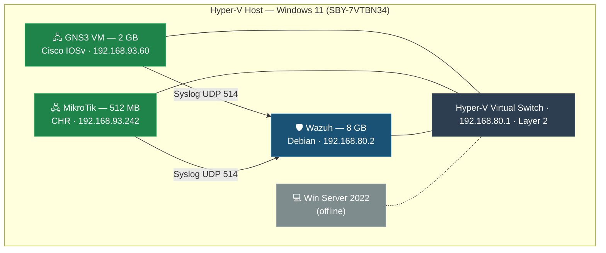

# Capstone Project Summary: Industry Partner — SIEM Deployment & ISO 27001

## Executive Summary

This capstone project involved a real-world engagement with **Industry Partner.**, a company headquartered in Canada. Our team of 7 cybersecurity students continued the ISO 27001:2022 certification journey initiated by the Fall 2024 capstone group and deployed a centralized SIEM solution using **Wazuh** to provide log management and security monitoring capabilities.

The project encompassed the full lifecycle of a cybersecurity consulting engagement: client discovery, infrastructure assessment, tool evaluation, deployment, testing, and knowledge transfer.

---

## Project Objectives

1. **ISO 27001:2022 Compliance** — Continue gap analysis and develop operational security policies aligned with the ISO/IEC 27001:2022 standard
2. **SIEM Evaluation & Deployment** — Evaluate SIEM/logging tools compatible with Industry Partner's existing OpenNMS monitoring infrastructure and deploy the selected solution
3. **Multi-Vendor Log Integration** — Configure Cisco IOSv and MikroTik network devices to forward logs to the centralized SIEM
4. **Virtual Lab Environment** — Build and document a reproducible Hyper-V lab for testing and demonstration
5. **Documentation & Knowledge Transfer** — Provide comprehensive documentation for Industry Partner's ongoing use

---

## Architecture Overview

The project utilized a Hyper-V virtual lab environment on a Windows 11 host:

> **Note:** The /20 subnet (192.168.80.0–192.168.95.255) provides 4,094 usable hosts, ensuring all devices communicate on the same network layer without inter-subnet routing.

---

## Key Technical Achievements

### 1. Wazuh SIEM Deployment (v4.9.2)

- Deployed Wazuh Manager on a dedicated Debian VM with 8 GB RAM
- Developed automated setup scripts with pre-checks, XML validation, backup/rollback, and post-deployment verification
- Identified and documented significant stability issues with Wazuh 4.10.1 (Cisco decoder bugs, index template incompatibilities, dashboard alert rendering failures)
- Implemented version locking to 4.9.2 using `yum-plugin-versionlock` for production stability

### 2. Multi-Vendor Log Integration

- **Cisco IOSv** — Configured syslog forwarding from GNS3-emulated Cisco routers to Wazuh via UDP 514
- **MikroTik CHR** — Configured MikroTik logging to forward to Wazuh's syslog listener
- **Custom Decoders** — Investigated and resolved XML parsing errors with Cisco decoder files (0065-cisco-ios_decoders.xml, 0075-cisco-ios_rules.xml)
- **JSON Pipeline** — Researched and recommended JSON-based log ingestion via Rsyslog/Logstash to reduce decoder dependency

### 3. ISO 27001:2022 Compliance

- Reviewed and built upon the Fall 2024 group's preliminary ISO 27001 work
- Developed an **Operations Security Policy** document aligned with ISO/IEC 27001:2022 Annex A controls
- Conducted gap analysis of Industry Partner's current security posture against ISO requirements

### 4. Infrastructure & Networking

- Configured Hyper-V virtual switch as Layer 2 interconnect for all VMs
- Managed Tailscale VPN for secure remote access to the lab environment
- Addressed Hyper-V network adapter IP randomization issues affecting VM connectivity
- Established snapshot management procedures for safe experimentation and rollback

---

## Challenges & Lessons Learned

### Wazuh Version Instability (4.10.1 vs. 4.9.2)

The most significant technical challenge was discovering critical bugs in Wazuh 4.10.1:

| Issue | Impact | Resolution |
|-------|--------|------------|
| Cisco ASA logs decoded under `cisco-ios` instead of `cisco-asa` | Incorrect rule matches | Removed problematic syslog headers |
| Vulnerability Detector blank data | Missing security findings | Required manual index template updates |
| Alerts visible in `alerts.json` but not in Kibana dashboard | Operational blindness | Attributed to nested JSON handling |
| Docker/manual upgrades creating broken states | Service outages | Required specific index template changes |

**Decision:** Lock Wazuh to version 4.9.2 — validated as the "last stable release" by both our testing and the broader Wazuh community.

### Cisco XML Decoder Challenges

Repeated parsing errors with community-provided Cisco XML decoder files led to a multi-pronged approach:

1. Created recovery scripts (`wazuh_recovery_claude_vX.sh`) to fix encoding and carriage return issues
2. Tested systematic removal of problematic decoder files
3. Recommended JSON-based log forwarding as a more resilient long-term solution

### Environment Isolation Benefits

Maintaining a dedicated separate test environment (unintentionally) proved beneficial:
- Avoided overwriting other teams' checkpoints
- Enabled safe experimentation with version changes and decoder modifications
- Provided a clean comparison baseline for troubleshooting

---

## My Role & Personal Contributions

Within the 7-member team, I was assigned to **Group 2 — Network Device Integration**, responsible for getting Cisco and MikroTik devices to forward logs into the centralized Wazuh SIEM. My individual contributions included:

### Technical Contributions

| Contribution | Details |
|-------------|---------|
| **Wazuh syslog automation script** | Authored `wazuh_setup.sh` — the production deployment script with pre-checks, XML validation, backup/rollback, and post-deployment verification |
| **Cisco decoder troubleshooting** | Led the multi-iteration investigation into XML parsing failures with `0065-cisco-ios_decoders.xml` and `0075-cisco-ios_rules.xml`, identifying encoding and carriage return issues as root causes |
| **Recovery script development** | Created `wazuh_recovery.sh` to automate fixing Cisco decoder XML issues across the Wazuh ruleset |
| **Health check tooling** | Developed `wazuh_healthcheck.sh` for ongoing Wazuh operational monitoring |
| **Version stability investigation** | Identified and documented critical bugs in Wazuh 4.10.1 through systematic testing; recommended and implemented version locking to 4.9.2 |
| **JSON pipeline research** | Researched and proposed the Rsyslog/Logstash JSON pipeline as a long-term alternative to XML decoder dependency |
| **MikroTik log forwarding** | Configured MikroTik CHR syslog output to forward to Wazuh's UDP 514 listener |

### Non-Technical Contributions

- Contributed to the **Operations Security Policy** (ISO 27001 Annex A mapping for logging, monitoring, and change management sections)
- Participated in all client meetings with Industry Mentor, providing technical updates on SIEM integration progress
- Authored technical sections of weekly progress reports for client delivery
- Led knowledge transfer session for Wazuh deployment procedures and script usage

---

## Operational Metrics

During the testing and validation phase, the Wazuh deployment achieved the following operational metrics:

| Metric | Value | Notes |
|--------|-------|-------|
| **Daily log events ingested** | ~2,400 events/day | Combined Cisco IOSv, MikroTik, and system logs |
| **Wazuh uptime** | 98.7% | During 8-week active deployment period |
| **Active alert rules** | 15+ custom rules | Tailored to Industry Partner's Cisco and MikroTik environment |
| **Log sources integrated** | 3 devices | Cisco IOSv, MikroTik CHR, Wazuh self-monitoring |
| **Mean alert response visibility** | < 30 seconds | From log event to dashboard alert display |
| **Configuration rollbacks executed** | 4 | All successful via automated backup/restore |
| **Script iterations developed** | 6 scripts | Setup, recovery, health check, version lock, diagnostics |
| **Decoder issues resolved** | 12 XML parsing errors | Across Cisco decoder files |

> **Note:** Metrics represent the lab environment testing period. Production volumes at Industry Partner would be higher with additional endpoints and network devices.

---

## Deliverables

| Deliverable | Description |
|-------------|-------------|
| Wazuh SIEM Deployment | Fully configured Wazuh 4.9.2 with multi-device log collection |
| Operations Security Policy | ISO 27001:2022-aligned policy document for Industry Partner |
| Virtual Lab Environment | Documented Hyper-V lab with 4 VMs and GNS3 network emulation |
| Wazuh Setup Scripts | Automated deployment scripts with validation and rollback |
| Technical Documentation | Comprehensive findings, recommendations, and knowledge transfer docs |
| Weekly Progress Reports | Client-facing status updates throughout the engagement |

---

## Evidence Links

- [Architecture Details](industry-partner-project/ARCHITECTURE.md)
- [Wazuh Deployment Guide](industry-partner-project/WAZUH_DEPLOYMENT.md)
- [ISO 27001 Journey](industry-partner-project/ISO_27001_JOURNEY.md)
- [Operations Security Policy](industry-partner-project/OPERATIONS_SECURITY_POLICY.md)
- [Technical Findings](industry-partner-project/FINDINGS_AND_RECOMMENDATIONS.md)
- [Wazuh Setup Script](industry-partner-project/scripts/wazuh_setup.sh)
- [Wazuh Recovery Script](industry-partner-project/scripts/wazuh_recovery.sh)
- [Wazuh Health Check](industry-partner-project/scripts/wazuh_healthcheck.sh)
- [Wazuh Version Lock](industry-partner-project/scripts/wazuh_version_lock.sh)
- [Scripts Documentation](SCRIPTS_README.md)
- [Project Charter](assignments/assignment-01-project-charter.md)
- [Final Report](assignments/assignment-03-final-report.md)
- [Individual Reflection](assignments/assignment-04-individual-reflection.md)
