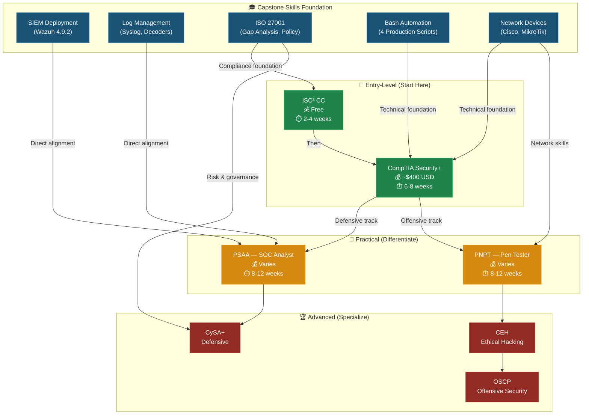

# Certification Resources

Cybersecurity certifications recommended during the capstone course for career preparation, mapped to capstone skills.

---

## Certification Pathway — From Capstone to Career

---

## Recommended Certifications

### Entry-Level / Foundational

| Certification | Organization | Cost | Capstone Alignment | Notes |
|--------------|-------------|------|-------------------|-------|
| **Certified in Cybersecurity (CC)** | ISC² | **Free** | ISO 27001 gap analysis, risk assessment, policy development | Part of the [One Million Certified program](https://www.isc2.org/landing/1mcc). Excellent first certification for new graduates. |
| **CompTIA Security+** | CompTIA | ~$400 USD | SIEM concepts, log analysis, network security fundamentals | Industry-standard foundational security certification. Widely recognized by employers. |

### Practical / Hands-On

| Certification | Organization | Cost | Capstone Alignment | Notes |
|--------------|-------------|------|-------------------|-------|
| **Practical SOC Analyst Associate (PSAA)** | TCM Security | Varies | **Strongest match** — Wazuh SIEM deployment, log analysis, alert triage, decoder troubleshooting | [Practical assessment](https://certifications.tcm-sec.com/psaa/) focused on real-world SOC skills. Recommended by Instructor Course Instructor. |
| **Practical Network Penetration Tester (PNPT)** | TCM Security | Varies | Network device configuration, Cisco/MikroTik knowledge, Bash scripting | Practical penetration testing certification with hands-on exam. |

### Advanced / Specialized

| Certification | Organization | Focus | Capstone Alignment |
|--------------|-------------|-------|-------------------|
| **CompTIA CySA+** | CompTIA | Cybersecurity analysis and threat detection | SIEM operations, log correlation, incident detection |
| **Certified Ethical Hacker (CEH)** | EC-Council | Penetration testing and ethical hacking | Network reconnaissance, device enumeration |
| **OSCP** | OffSec | Advanced penetration testing (highly regarded) | Bash scripting, network exploitation, automation |

---

## Certification Strategy for New Graduates

Based on guidance from Instructor Course Instructor and guest speaker Industry Speaker:

1. **Start with ISC² CC** — Free, builds foundational knowledge, and provides ISC² membership benefits
2. **Add CompTIA Security+** — Most widely requested certification in job postings
3. **Differentiate with PSAA** — Demonstrates practical SOC analyst skills; the capstone SIEM deployment provides direct hands-on preparation
4. **Specialize based on career path** — Choose between defensive (CySA+) or offensive (PNPT/OSCP) tracks

### Estimated Investment Summary

| Path | Certifications | Estimated Cost | Estimated Time |
|------|---------------|:--------------:|:--------------:|
| **Quick Start** | ISC² CC only | Free | 2-4 weeks |
| **Recommended** | ISC² CC → Security+ → PSAA | ~$400-700 USD | 4-6 months |
| **Defensive Track** | CC → Security+ → PSAA → CySA+ | ~$800-1,200 USD | 8-12 months |
| **Offensive Track** | CC → Security+ → PNPT → OSCP | ~$2,000-3,500 USD | 12-18 months |

---

## Additional Resources

- [ISC² One Million Certified in Cybersecurity](https://www.isc2.org/landing/1mcc) — Free CC certification
- [TCM Security Certifications](https://certifications.tcm-sec.com/) — Practical cybersecurity certifications
- [CompTIA Certification Roadmap](https://www.comptia.org/certifications) — IT certification pathways
- [Canadian Cyber Security Network](https://canadiancybersecuritynetwork.com/) — Career networking and job placement

---

> *Last updated: 2026-04-06 — Portfolio remediation and visualization enhancements*
