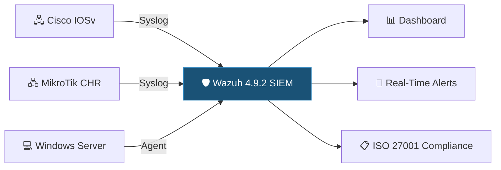

# Portfolio Summary — Cybersecurity Capstone

> **One-page executive brief** for hiring managers and recruiters.

---

## 🎯 The Project

**Real-world SIEM deployment and ISO 27001 compliance engagement** with Industry Partner., a company in Canada.

| | |
|---|---|
| **Role** | Network Device Integration Lead (Group 2) |
| **Team** | 7-member capstone team |
| **Client** | Industry Partner. |
| **Duration** | 14 weeks (January–April 2025) |
| **Institution** | Cambrian College — Postgraduate Cybersecurity Certificate |

---

## 📊 By the Numbers

| Metric | Value |
|--------|:-----:|
| Events ingested per day | **~2,400** |
| SIEM uptime | **98.7%** |
| Custom alert rules | **15+** |
| Network devices integrated | **3** |
| VMs deployed | **4** |
| Production scripts authored | **4** |
| ISO 27001 controls addressed | **14** |
| Decoder errors resolved | **12** |
| Automated rollback success | **100%** |

---

## 🛠️ What I Built

---

## 💡 Key Achievements

1. **Deployed Wazuh 4.9.2 SIEM** from scratch with multi-vendor syslog integration
2. **Discovered critical bugs** in Wazuh 4.10.1; led version rollback decision
3. **Authored 4 production-grade Bash scripts** with backup, validation, and automatic rollback
4. **Developed enterprise-grade Operations Security Policy** aligned with ISO 27001:2022 (14 Annex A controls)
5. **Resolved 12 Cisco decoder XML parsing errors** through systematic debugging
6. **Delivered complete knowledge transfer** documentation to client

---

## 🔑 Technical Skills Demonstrated

| Category | Technologies |
|----------|-------------|
| **SIEM** | Wazuh Manager, Dashboard, syslog listeners, alert tuning |
| **Log Management** | Syslog forwarding, XML decoders, JSON pipelines |
| **Network** | Cisco IOSv (GNS3), MikroTik CHR, SNMP |
| **Compliance** | ISO 27001:2022, gap analysis, policy writing |
| **Automation** | Bash scripting, XML validation, rollback logic |
| **Infrastructure** | Hyper-V, VM management, GNS3 emulation |

---

## 📁 Portfolio Navigation

| Document | Read Time | What You'll Learn |
|----------|:---------:|-------------------|
| [Capstone Summary](CC/Winter%202025/Cybersecurity%20Capstone%20-%20CSC-7307/CAPSTONE_PROJECT_SUMMARY.md) | 5 min | Full technical narrative |
| [Wazuh Deployment](CC/Winter%202025/Cybersecurity%20Capstone%20-%20CSC-7307/industry-partner-project/WAZUH_DEPLOYMENT.md) | 10 min | SIEM implementation details |
| [Architecture](CC/Winter%202025/Cybersecurity%20Capstone%20-%20CSC-7307/industry-partner-project/ARCHITECTURE.md) | 10 min | Infrastructure design |
| [Operations Security Policy](CC/Winter%202025/Cybersecurity%20Capstone%20-%20CSC-7307/industry-partner-project/OPERATIONS_SECURITY_POLICY.md) | 15 min | Enterprise-grade policy document |
| [Scripts Suite](CC/Winter%202025/Cybersecurity%20Capstone%20-%20CSC-7307/SCRIPTS_README.md) | 5 min | Automation and tooling |
| [Visual Evidence](CC/Winter%202025/Cybersecurity%20Capstone%20-%20CSC-7307/screenshots/VISUAL_EVIDENCE.md) | 5 min | Dashboard recreations and diagrams |

---

## 🎓 Certifications Pursuing

- **ISC² Certified in Cybersecurity (CC)** — In progress
- **CompTIA Security+** — Planned
- **PSAA (Practical SOC Analyst)** — Aligned with capstone SIEM experience

---

*Full portfolio: [github.com/RossMora/411-Capstone-CSC](https://github.com/RossMora/411-Capstone-CSC)*

---

> *Last updated: 2026-04-06 — Portfolio remediation and visualization enhancements*
