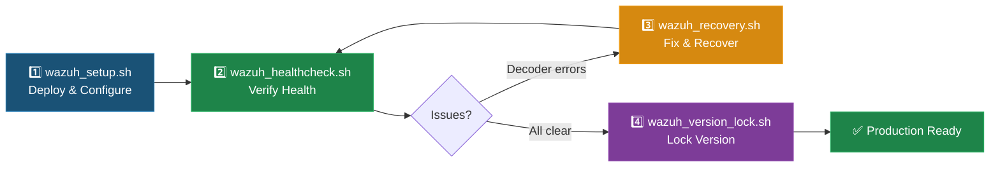

# Scripts README

## Overview

Scripts developed during the Cybersecurity Capstone (CSC-7307) for the Industry Partner SIEM deployment project. All scripts follow consistent patterns: color-coded output, structured error handling, and safety-first design.

---

## Script Catalog

### At-A-Glance Comparison

| Script | When to Use | Duration | Risk Level |
|--------|-------------|:--------:|:----------:|
| `wazuh_setup.sh` | Initial Wazuh syslog integration setup | ~3 min | Medium |
| `wazuh_recovery.sh` | After Cisco decoder XML errors | ~2 min | Low |
| `wazuh_healthcheck.sh` | Routine health verification (weekly/monthly) | < 1 min | None |
| `wazuh_version_lock.sh` | After successful deployment to prevent upgrades | < 1 min | Low |

### Recommended Execution Order



---

### `wazuh_setup.sh` — Wazuh Syslog Integration Setup

| Property | Value |
|----------|-------|
| **Location** | [`industry-partner-project/scripts/wazuh_setup.sh`](industry-partner-project/scripts/wazuh_setup.sh) |
| **Language** | Bash |
| **Requires** | Root privileges, Wazuh Manager installed, `xmllint` |
| **Purpose** | Automates Wazuh syslog listener configuration for receiving logs from Cisco and MikroTik devices |

#### Usage

```bash
sudo ./wazuh_setup.sh
```

#### What It Does

1. **Pre-checks** — Verifies root execution, Wazuh service status, `ossec.conf` accessibility, network connectivity, and port availability
2. **Configuration** — Creates a backup, injects syslog listener block into `ossec.conf`, validates XML syntax, and restarts the Wazuh service
3. **Post-checks** — Confirms service is running, syslog port is listening, processes are active, and no errors in logs
4. **Monitoring** — Tails Wazuh logs for 30 seconds to confirm syslog/Cisco event reception

#### Safety Features

- Timestamped configuration backup before any changes
- XML syntax validation with `xmllint` before applying
- Wazuh configuration validation with `wazuh-control validate`
- Automatic rollback to backup on any validation failure
- Cleanup trap for monitoring processes on exit

#### Configuration Variables

```bash
WAZUH_IP="192.168.80.2"      # Wazuh Manager IP
RSYSLOG_IP="192.168.93.60"   # Syslog source IP (Cisco IOSv)
SYSLOG_PORT="514"             # Syslog listening port
SYSLOG_PROTOCOL="udp"         # Protocol (UDP for syslog)
OSSEC_CONF="/var/ossec/etc/ossec.conf"  # Wazuh config path
```

---

### `wazuh_recovery.sh` — Cisco Decoder Recovery

| Property | Value |
|----------|-------|
| **Location** | [`industry-partner-project/scripts/wazuh_recovery.sh`](industry-partner-project/scripts/wazuh_recovery.sh) |
| **Language** | Bash |
| **Requires** | Root privileges, Wazuh Manager installed |
| **Purpose** | Fixes Cisco decoder XML parsing errors caused by encoding issues and carriage returns |

#### Usage

```bash
sudo ./wazuh_recovery.sh
```

#### What It Does

1. **Scans** Wazuh decoder directory for XML files with encoding issues or carriage returns
2. **Backs up** affected files before modification
3. **Fixes** encoding problems in `0065-cisco-ios_decoders.xml`, `0075-cisco-ios_rules.xml`, and other affected files
4. **Validates** all XML files after fixes using `xmllint`
5. **Restarts** Wazuh Manager and verifies clean startup

---

### `wazuh_healthcheck.sh` — Comprehensive Health Diagnostic

| Property | Value |
|----------|-------|
| **Location** | [`industry-partner-project/scripts/wazuh_healthcheck.sh`](industry-partner-project/scripts/wazuh_healthcheck.sh) |
| **Language** | Bash |
| **Requires** | Root privileges, Wazuh Manager installed |
| **Purpose** | 9-point comprehensive Wazuh health verification with PASS/WARN/FAIL summary |

#### Usage

```bash
sudo ./wazuh_healthcheck.sh
```

#### Checks Performed

| # | Check | Pass Criteria |
|---|-------|---------------|
| 1 | Service status | `wazuh-manager` active and running |
| 2 | Port listening | UDP 514, TCP 1514, TCP 1515, TCP 55000 |
| 3 | Disk usage | `/var/ossec` below 85% capacity |
| 4 | Log file sizes | Log files within expected size ranges |
| 5 | Recent errors | No ERROR entries in last 50 lines of `ossec.log` |
| 6 | Agent connections | Connected agents responding |
| 7 | Indexer status | Wazuh indexer reachable and healthy |
| 8 | Version verification | Running version matches expected (4.9.2) |
| 9 | Configuration validation | `wazuh-control validate` passes |

---

### `wazuh_version_lock.sh` — Version Lock Utility

| Property | Value |
|----------|-------|
| **Location** | [`industry-partner-project/scripts/wazuh_version_lock.sh`](industry-partner-project/scripts/wazuh_version_lock.sh) |
| **Language** | Bash |
| **Requires** | Root privileges, `yum-plugin-versionlock` or `apt-mark` |
| **Purpose** | Lock/unlock Wazuh package version to prevent accidental upgrades |

#### Usage

```bash
sudo ./wazuh_version_lock.sh lock      # Lock to current version
sudo ./wazuh_version_lock.sh unlock    # Remove version lock
sudo ./wazuh_version_lock.sh status    # Show current lock status
```

---

## Script Development History

The Wazuh tooling went through multiple iterations during development:

| Version | Focus | Key Changes |
|---------|-------|-------------|
| v1 | Initial deployment | Basic syslog configuration and validation |
| v2 | XML handling | Added `xmlstarlet` for better XML manipulation |
| v3 | Error handling | Improved failure modes and recovery procedures |
| v4 (diagnostic) | Health check | Focused on verification and diagnostic output |
| Final suite | Production tooling | Consolidated into 4 purpose-built scripts |

The final script suite provides complete lifecycle coverage: setup → recovery → health monitoring → version management.

---

## Troubleshooting Guide

| Error | Likely Cause | Fix |
|-------|-------------|-----|
| `Permission denied` | Script not run as root | Run with `sudo ./script_name.sh` |
| `xmllint: command not found` | libxml2-utils not installed | `apt install libxml2-utils` or `yum install libxml2` |
| `wazuh-manager: unrecognized service` | Wazuh not installed or wrong service name | Verify with `systemctl list-units \| grep wazuh` |
| `Address already in use (514)` | Another process on UDP 514 | Check with `netstat -tuln \| grep :514`; stop conflicting service |
| `XML validation failed` | Malformed ossec.conf | Script auto-rollbacks; check backup at `/var/ossec/etc/ossec.conf.backup.*` |
| `yum-plugin-versionlock not found` | Plugin not installed (RHEL/CentOS) | `yum install yum-plugin-versionlock` |
| `grep: invalid option -- 'P'` | Perl regex not supported (recovery script) | Install GNU grep or use system with PCRE support |
| `curl: connection refused (indexer)` | Wazuh indexer not running | `systemctl start wazuh-indexer`; check with healthcheck script |

### Example Output — Successful Setup

```
[PRE-CHECK] Verifying root execution ........................... OK
[PRE-CHECK] Checking xmllint availability ..................... OK
[PRE-CHECK] Verifying wazuh-manager service ................... OK
[PRE-CHECK] Validating ossec.conf exists ...................... OK
[PRE-CHECK] Testing network connectivity ...................... OK
[PRE-CHECK] Checking UDP 514 availability ..................... OK
[CONFIGURE] Creating backup: ossec.conf.backup.20250213-143022 OK
[CONFIGURE] Removing existing syslog block .................... OK
[CONFIGURE] Inserting new syslog configuration ................ OK
[VALIDATE]  XML syntax check (xmllint) ....................... PASS
[VALIDATE]  Wazuh configuration check ........................ PASS
[SERVICE]   Restarting wazuh-manager .......................... OK
[POST-CHECK] Service status: active (running) ................. OK
[POST-CHECK] UDP 514: LISTENING ............................... OK
[POST-CHECK] Processes: ossec-logcollector running ............ OK
[POST-CHECK] Recent errors: none .............................. OK
[MONITOR]   Tailing logs for 30 seconds... (syslog|cisco)
```

---

> *Last updated: 2026-04-06 — Portfolio remediation and visualization enhancements*
