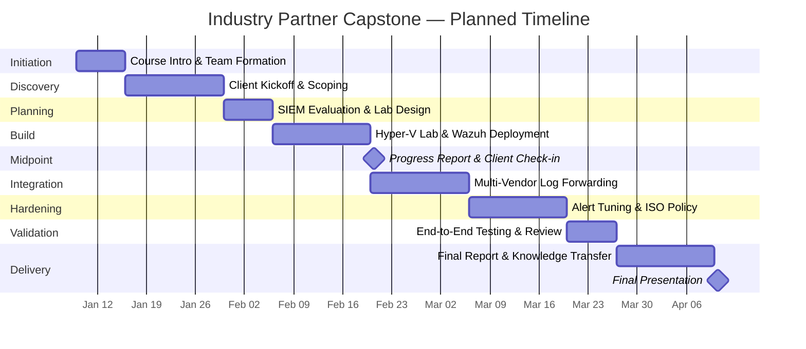
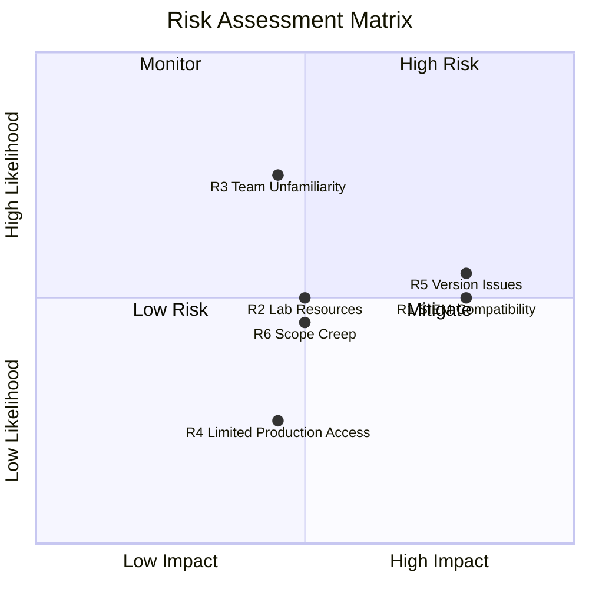

# Project Charter --- Industry Partner SIEM & ISO 27001 Engagement

**Course:** CSC-7307 Cybersecurity Capstone | **Term:** Winter 2025
**Institution:** Cambrian College | **Instructor:** Course Instructor
**Client:** Industry Partner. | **Client Contact:** Industry Mentor
**Date:** January 2025 (Week 2-3 Deliverable)

---

## 1. Executive Summary

This project charter establishes the scope, objectives, and governance structure for the Winter 2025 Cybersecurity Capstone engagement with Industry Partner. Our team of seven cybersecurity students will continue the ISO 27001:2022 certification journey initiated by the Fall 2024 capstone group and deploy a centralized SIEM solution to provide log management and security monitoring capabilities for the organization.

Industry Partner is a company headquartered in Canada. The engagement follows a professional consulting model, with weekly client communication, formal deliverables, and knowledge transfer at project completion.

---

## 2. Project Objectives

| ID | Objective | Priority |
|----|-----------|----------|
| O1 | Continue ISO 27001:2022 gap analysis and develop operational security policies | High |
| O2 | Evaluate and deploy a SIEM/logging platform compatible with Industry Partner's infrastructure | High |
| O3 | Integrate multi-vendor network devices (Cisco, MikroTik) with centralized log management | High |
| O4 | Build and document a reproducible virtual lab environment for testing | Medium |
| O5 | Deliver comprehensive documentation and knowledge transfer to the client | High |

---

## 3. Scope

### 3.1 In-Scope

- SIEM tool evaluation (Wazuh, Graylog, and alternatives) against Industry Partner's OpenNMS environment
- Wazuh Manager deployment on a dedicated Debian virtual machine
- Syslog-based log collection from Cisco IOSv and MikroTik network devices
- ISO 27001:2022 gap analysis building on Fall 2024 deliverables
- Operations Security Policy development aligned with Annex A controls
- Virtual lab environment design using Hyper-V and GNS3
- Automated deployment scripts with validation and rollback capability
- Weekly progress reporting and final knowledge transfer documentation

### 3.2 Out-of-Scope

- Production deployment on Industry Partner's live network infrastructure
- Full ISO 27001 certification audit preparation
- Penetration testing or vulnerability assessment of Industry Partner's systems
- Long-term SIEM monitoring or managed security services
- Hardware procurement or physical infrastructure changes
- Network redesign beyond the virtual lab environment

---

## 4. Team Structure

| Role | Responsibility |
|------|---------------|
| **Project Lead** | Overall coordination, client communication, milestone tracking |
| **Group 1 -- SIEM & Policy** | Wazuh deployment, ISO 27001 compliance, policy documentation |
| **Group 2 -- Network Integration** | Cisco and MikroTik device integration, syslog forwarding, custom decoders |
| **All Members** | Weekly reporting, documentation, peer review, final presentation |

**Team Size:** 7 members

---

## 5. Stakeholders

| Stakeholder | Organization | Role |
|-------------|-------------|------|
| Course Instructor | Cambrian College | Course Instructor, Project Supervisor |
| Industry Mentor | Industry Partner. | Client Contact, Technical Liaison |
| Fall 2024 Capstone Team | Cambrian College | Previous engagement; provided baseline ISO 27001 deliverables |
| Capstone Team (7 members) | Cambrian College | Project execution team |

---

## 6. Timeline

| Week | Phase | Key Activities |
|------|-------|---------------|
| 1 | Initiation | Course introduction, team formation, client matching |
| 2-3 | Discovery | Client kickoff meeting, project scoping, charter finalization |
| 4 | Planning | SIEM tool evaluation, lab environment design, task allocation |
| 5-6 | Build | Hyper-V lab setup, Wazuh deployment, device configuration |
| 7 | Midpoint | Progress report, client check-in, integration testing begins |
| 8-9 | Integration | Multi-vendor log forwarding, custom decoder development |
| 10-11 | Hardening | Alert rule tuning, ISO policy drafting, documentation |
| 12 | Validation | End-to-end testing, deliverable review, client walkthrough |
| 13-14 | Delivery | Final report, presentation, knowledge transfer, course wrap-up |

### Project Gantt Chart

---

## 7. Risk Register (Initial)

| ID | Risk | Likelihood | Impact | Mitigation |
|----|------|-----------|--------|------------|
| R1 | SIEM tool incompatible with Industry Partner's OpenNMS environment | Medium | High | Evaluate multiple tools early; confirm API/protocol compatibility |
| R2 | Insufficient lab resources (RAM, storage) for concurrent VMs | Medium | Medium | Optimize VM sizing; stagger startup; snapshot management |
| R3 | Team members unfamiliar with Wazuh or ISO 27001 | High | Medium | Allocate onboarding time; leverage Wazuh documentation and community |
| R4 | Limited access to Industry Partner's production systems | Low | Medium | Design lab to mirror production topology as closely as possible |
| R5 | Version or dependency issues with SIEM software | Medium | High | Maintain snapshots before upgrades; test in isolation first |
| R6 | Scope creep from additional client requests | Medium | Medium | Refer all scope changes to instructor; document change requests |

### Risk Heat Map

---

## 8. Success Criteria

- Wazuh SIEM deployed and collecting logs from at least two device types (Cisco, MikroTik)
- ISO 27001:2022 gap analysis completed with at least one formal policy document delivered
- Virtual lab environment fully documented and reproducible
- Automated deployment scripts with validation and rollback functionality
- Client receives knowledge transfer documentation sufficient for ongoing maintenance
- All deliverables submitted on time per the course schedule

---

## 9. Communication Plan

| Channel | Frequency | Participants | Purpose |
|---------|-----------|-------------|---------|
| In-class sessions | Weekly | Full team, Instructor | Status updates, technical guidance |
| Client meetings | Bi-weekly | Team lead, Client (Industry Mentor) | Progress updates, requirement clarification |
| Team collaboration | Ongoing | Full team | Task coordination, troubleshooting |
| Progress reports | Week 7, Week 13 | Full team, Instructor, Client | Formal milestone documentation |
| Final presentation | Week 14 | Full team, Instructor, Client | Project outcomes and knowledge transfer |

---

## Approval

This charter defines the engagement boundaries for the Winter 2025 Cybersecurity Capstone project with Industry Partner. All team members, the course instructor, and the client contact have reviewed and agreed to the scope, timeline, and deliverables outlined above.
