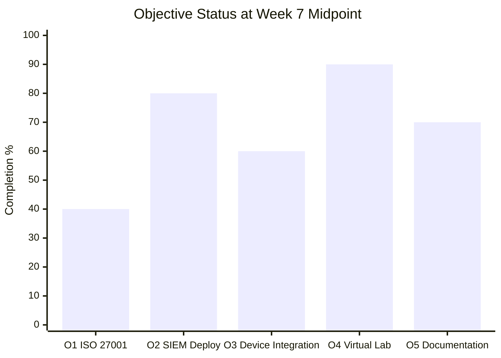
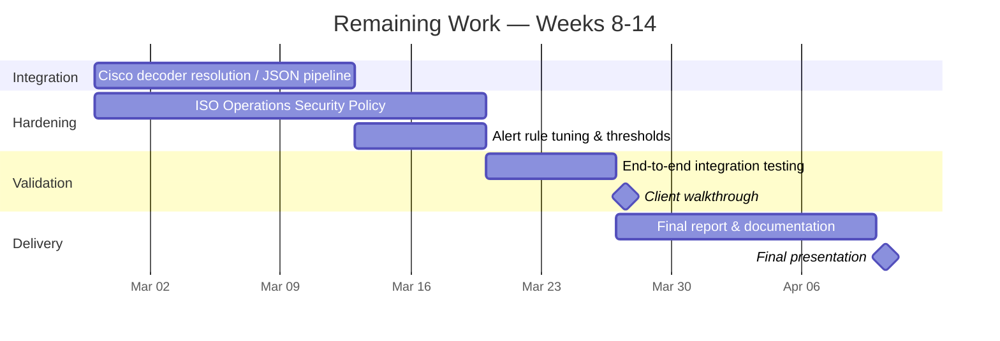

# Progress Report --- Industry Partner Capstone (Week 7)

**Course:** CSC-7307 Cybersecurity Capstone | **Term:** Winter 2025
**Institution:** Cambrian College | **Instructor:** Course Instructor
**Client:** Industry Partner. | **Client Contact:** Industry Mentor
**Report Date:** Mid-February 2025 (Week 7 Deliverable)

---

## 1. Executive Summary

At the midpoint of the Winter 2025 Cybersecurity Capstone engagement, the team has made substantial progress across all primary objectives. The Wazuh SIEM platform has been deployed on a dedicated Debian VM and is actively collecting syslog data from both Cisco IOSv and MikroTik devices. The Hyper-V virtual lab environment is fully operational with four VMs on a /20 subnet.

A critical discovery this period was the identification of significant stability issues in Wazuh 4.10.1, including Cisco decoder bugs and dashboard alert rendering failures. The team has locked the deployment to Wazuh 4.9.2, which has been validated as the last stable release. ISO 27001 gap analysis is underway, building on the Fall 2024 group's deliverables.

---

## 2. Objectives Status

| ID | Objective | Status | Notes |
|----|-----------|--------|-------|
| O1 | ISO 27001:2022 gap analysis and policy development | Amber | Gap analysis in progress; policy drafting to begin Week 8 |
| O2 | SIEM platform evaluation and deployment | Green | Wazuh 4.9.2 deployed and operational on Debian VM |
| O3 | Multi-vendor device integration | Amber | Cisco syslog active; MikroTik forwarding configured; decoder issues being resolved |
| O4 | Virtual lab environment | Green | Hyper-V lab with 4 VMs fully operational |
| O5 | Documentation and knowledge transfer | Green | Weekly notes maintained; architecture documented |

**RAG Legend:** Green = on track | Amber = minor issues, recoverable | Red = at risk

---

## 3. Technical Progress

### 3.1 Wazuh SIEM Deployment

The Wazuh Manager has been deployed on a dedicated Debian VM (8 GB RAM, IP 192.168.80.2) within the Hyper-V lab environment. Key accomplishments:

- Wazuh Manager installed and configured with syslog listeners on UDP 514
- Wazuh Dashboard accessible and displaying ingested events
- Version locked to 4.9.2 using `yum-plugin-versionlock` after stability testing
- Automated setup script (`wazuh_setup.sh`) developed with pre-checks, XML validation, and rollback capability

### 3.2 Network Device Integration

**Cisco IOSv (via GNS3):**
- Syslog forwarding configured from the GNS3-emulated Cisco router (192.168.93.60) to the Wazuh Manager
- Logs arriving at Wazuh via UDP 514
- Custom decoder investigation ongoing due to XML parsing errors in community-provided decoder files (0065-cisco-ios_decoders.xml, 0075-cisco-ios_rules.xml)

**MikroTik CHR:**
- MikroTik RouterOS logging configured to forward syslog to Wazuh (192.168.93.242)
- Syslog events successfully received and indexed

### 3.3 ISO 27001:2022 Compliance

- Reviewed Fall 2024 capstone group's preliminary ISO 27001 deliverables
- Identified gaps in operational security controls
- Initiated development of an Operations Security Policy aligned with Annex A controls
- Full policy drafting scheduled for Weeks 8-10

---

## 4. Challenges Encountered

### 4.1 Wazuh 4.10.1 Stability Issues (Key Finding)

The team's most significant technical discovery was identifying critical bugs in Wazuh version 4.10.1. During an upgrade attempt from the baseline 4.9.2 installation, the following issues were observed:

| Issue | Impact |
|-------|--------|
| Cisco ASA logs incorrectly decoded under `cisco-ios` instead of `cisco-asa` | Mismatched alert rules; false classifications |
| Vulnerability Detector returning blank data | Loss of security vulnerability findings |
| Alerts present in `alerts.json` but absent from the Kibana dashboard | Operational blindness; alerts not visible to operators |
| Docker and manual upgrade paths producing broken service states | Repeated service outages requiring snapshot rollback |

**Decision:** The team rolled back to Wazuh 4.9.2 and implemented version locking. Community reports confirmed 4.9.2 as the last stable release, validating this approach.

### 4.2 Cisco Decoder XML Parsing Errors

The community-provided Cisco XML decoder files contained formatting and encoding issues that caused Wazuh's analysis engine to fail on certain log patterns. Troubleshooting efforts included:

- Recovery scripts to fix encoding and carriage return issues in decoder XML files
- Systematic removal and re-introduction of problematic decoder files to isolate failures
- Initial research into JSON-based log forwarding via Rsyslog as a longer-term alternative

### 4.3 Hyper-V Network Adapter Behavior

An observed quirk with the Hyper-V network adapter occasionally randomizing its IP subnet upon host reboot. This caused VM connectivity loss when static IPs fell outside the reassigned range. The team mitigated this by verifying adapter settings after each reboot and documenting the behavior for knowledge transfer.

---

## 5. Mitigation Actions

| Challenge | Action Taken | Status |
|-----------|-------------|--------|
| Wazuh 4.10.1 instability | Rolled back to 4.9.2; applied version locking | Complete |
| Cisco decoder XML errors | Created recovery scripts; investigating JSON pipeline | In progress |
| Hyper-V IP randomization | Documented verification procedure; static IP enforcement | Complete |
| ISO 27001 gap analysis pacing | Allocated dedicated sessions in Weeks 8-10 for policy work | Planned |

---

## 6. Updated Risk Register

| ID | Risk | Status | Update |
|----|------|--------|--------|
| R1 | SIEM incompatible with OpenNMS | Closed | Wazuh selected and deployed; compatible via syslog |
| R2 | Insufficient lab resources | Mitigated | VM sizing optimized; snapshot strategy in place |
| R3 | Team unfamiliarity with tools | Mitigated | Onboarding complete; team productive with Wazuh |
| R4 | Limited production access | Accepted | Lab mirrors production topology sufficiently |
| R5 | SIEM version/dependency issues | Active | Materialized with 4.10.1; resolved via version lock |
| R6 | Scope creep | Low | No additional client requests to date |
| R7 | Cisco decoder resolution delays integration | New | JSON pipeline under evaluation as fallback |

---

## 7. Next Steps (Weeks 8-14)

| Week | Planned Activity |
|------|-----------------|
| 8-9 | Resolve Cisco decoder issues or implement JSON log pipeline; begin ISO policy drafting |
| 10 | Complete Operations Security Policy; alert rule tuning and threshold configuration |
| 11 | End-to-end integration testing across all log sources; documentation review |
| 12 | Client walkthrough of deliverables; final testing and validation |
| 13-14 | Final report, presentation, and knowledge transfer to Industry Partner |

---

## Summary

The project is on track for successful delivery. The Wazuh SIEM is operational and collecting logs from multiple device types, the lab environment is stable, and the team has navigated a significant technical challenge with the Wazuh version instability. The primary risks for the second half are completing the Cisco decoder resolution and delivering the ISO 27001 policy documentation on schedule.
