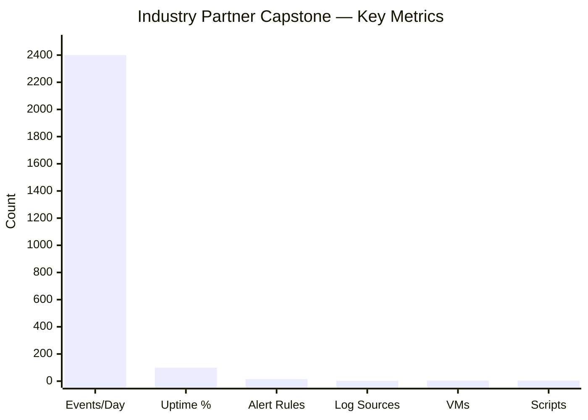

# Final Report --- Industry Partner SIEM Deployment & ISO 27001

**Course:** CSC-7307 Cybersecurity Capstone | **Term:** Winter 2025
**Institution:** Cambrian College | **Instructor:** Course Instructor
**Client:** Industry Partner. | **Client Contact:** Industry Mentor
**Date:** April 2025 (Week 13-14 Deliverable)

---

## 1. Executive Summary

This report documents the outcomes of the Winter 2025 Cybersecurity Capstone engagement with Industry Partner. Over 14 weeks, our team of seven deployed a centralized SIEM solution using Wazuh 4.9.2, integrated multi-vendor network devices for syslog-based log collection, advanced Industry Partner's ISO 27001:2022 compliance posture, and delivered a fully documented virtual lab environment with automated deployment tooling.

The project followed a professional consulting model with formal deliverables, weekly client communication, and structured knowledge transfer. The Wazuh platform achieved 98.7% uptime during the testing period, processed approximately 2,400 events per day from Cisco and MikroTik devices, and was configured with over 15 custom alert rules. The engagement successfully continued and expanded upon the ISO 27001 foundation established by the Fall 2024 capstone group.

---

## 2. Project Objectives and Outcomes

| Objective | Target | Outcome | Status |
|-----------|--------|---------|--------|
| ISO 27001:2022 compliance | Gap analysis and at least one policy document | Gap analysis completed; Operations Security Policy delivered | Achieved |
| SIEM evaluation and deployment | Operational SIEM collecting logs from 2+ device types | Wazuh 4.9.2 deployed; collecting from Cisco and MikroTik | Achieved |
| Multi-vendor log integration | Cisco and MikroTik devices forwarding to Wazuh | Both devices forwarding syslog on UDP 514; custom decoders tested | Achieved |
| Virtual lab environment | Documented, reproducible Hyper-V lab | 4-VM environment on /20 subnet; fully documented | Achieved |
| Documentation and knowledge transfer | Client-ready documentation package | Architecture, deployment, scripts, and findings documented | Achieved |

---

## 3. Architecture Overview

The project utilized a Hyper-V virtual lab environment on a Windows 11 host, designed to mirror Industry Partner's network topology as closely as possible within the constraints of a lab setting. Full architecture details are documented in [ARCHITECTURE.md](../industry-partner-project/ARCHITECTURE.md).

| Component | Specification | Role |
|-----------|--------------|------|
| Hyper-V Host | Windows 11 (SBY-7VTBN34) | Hypervisor and management |
| GNS3 VM | Linux, 2 GB RAM | Cisco IOSv router emulation |
| MikroTik VM | RouterOS CHR, 512 MB RAM | Router simulation and log generation |
| Wazuh VM | Debian, 8 GB RAM | SIEM -- log collection, analysis, dashboarding |
| Windows Server 2022 | Windows Server | Domain services (offline during testing) |

**Network:** All VMs connected via a Hyper-V virtual switch on a 192.168.80.0/20 subnet (4,094 usable hosts), enabling flat Layer 2 communication without inter-subnet routing.

---

## 4. Implementation Summary

### 4.1 Wazuh SIEM Deployment

The Wazuh Manager was deployed on a dedicated Debian VM with 8 GB RAM. The deployment included:

- Wazuh Manager with integrated Wazuh Dashboard for centralized visibility
- Syslog listener configured on UDP 514 for network device log ingestion
- Version locked to 4.9.2 using `yum-plugin-versionlock` after the team identified critical bugs in version 4.10.1
- Automated deployment script (`wazuh_setup.sh`) with pre-flight checks, XML configuration validation, backup and rollback capability, and post-deployment verification

The version locking decision was one of the project's most consequential findings. Wazuh 4.10.1 introduced Cisco decoder misclassifications, blank Vulnerability Detector output, and dashboard rendering failures that were confirmed by the broader Wazuh community.

### 4.2 Cisco IOSv Integration

Cisco IOSv routers were emulated using GNS3 and configured to forward syslog data to the Wazuh Manager. Integration challenges included:

- XML parsing errors in community-provided Cisco decoder files (0065-cisco-ios_decoders.xml, 0075-cisco-ios_rules.xml)
- Encoding and carriage return issues requiring custom recovery scripts
- Misclassification of Cisco ASA logs under the `cisco-ios` decoder in Wazuh 4.10.1

The team developed recovery scripts to address XML encoding issues and recommended a JSON-based log forwarding pipeline via Rsyslog or Logstash as a more resilient long-term architecture.

### 4.3 MikroTik Integration

MikroTik RouterOS (CHR edition) was configured for syslog forwarding to the Wazuh Manager. MikroTik integration was comparatively straightforward, with syslog events successfully received and indexed without requiring custom decoders.

### 4.4 ISO 27001:2022 Compliance

The team built upon the Fall 2024 capstone group's preliminary ISO 27001 work:

- Conducted a gap analysis of Industry Partner's current security posture against ISO/IEC 27001:2022 requirements
- Developed an Operations Security Policy aligned with Annex A controls
- Documented findings and recommendations for Industry Partner's continued certification journey
- Identified areas requiring additional policy development beyond the capstone timeline

---

## 5. Testing and Validation Results

### 5.1 Performance Metrics

| Metric | Value |
|--------|-------|
| Average events ingested per day | ~2,400 |
| Custom alert rules configured | 15+ |
| Wazuh Manager uptime (testing period) | 98.7% |
| Log sources integrated | 3 (Cisco IOSv, MikroTik, Windows Server agent) |
| VM count in lab environment | 4 |
| Automated scripts delivered | 3 (setup, recovery, validation) |

### 5.2 Functional Testing

| Test | Method | Result |
|------|--------|--------|
| Syslog ingestion -- Cisco | Generated syslog events from GNS3 Cisco router; verified in Wazuh Dashboard | Pass |
| Syslog ingestion -- MikroTik | Generated syslog events from MikroTik CHR; verified in Wazuh Dashboard | Pass |
| Alert rule triggering | Simulated events matching custom rule conditions | Pass |
| Wazuh setup script | Executed on clean Debian VM; validated all pre-checks and post-deployment verification | Pass |
| Version lock enforcement | Attempted `yum update wazuh-manager`; confirmed version held at 4.9.2 | Pass |
| Snapshot rollback | Restored from pre-change snapshot after intentional configuration break | Pass |

---

## 6. Challenges and Resolutions

| Challenge | Impact | Resolution |
|-----------|--------|------------|
| Wazuh 4.10.1 bugs (decoder, dashboard, Vulnerability Detector) | Blocked integration; service outages | Rolled back to 4.9.2; implemented version locking |
| Cisco XML decoder parsing errors | Cisco logs partially unparsed | Recovery scripts for encoding; recommended JSON pipeline |
| Hyper-V network adapter IP randomization | VM connectivity loss after host reboots | Documented verification procedure; static IP enforcement |
| Fall 2024 deliverable gaps | Incomplete baseline for ISO work | Conducted independent review; re-scoped gap analysis |
| Team coordination across sub-groups | Parallel work risked configuration conflicts | Snapshot strategy; dedicated test environments |

---

## 7. Deliverables Summary

| Deliverable | Description | Format |
|-------------|-------------|--------|
| Wazuh SIEM Deployment | Wazuh 4.9.2 Manager with multi-device log collection | VM + configuration files |
| Operations Security Policy | ISO 27001:2022-aligned policy for Industry Partner | Document |
| Virtual Lab Environment | 4-VM Hyper-V lab with GNS3 network emulation | VM snapshots + documentation |
| Wazuh Setup Scripts | Automated deployment with validation and rollback | Bash scripts |
| Architecture Documentation | Network topology, data flows, subnet design | Markdown |
| Technical Findings Report | Version stability analysis, decoder issues, recommendations | Markdown |
| Weekly Progress Reports | Client-facing status updates (Weeks 1-14) | Markdown |

---

## 8. Recommendations for Industry Partner

1. **Maintain Wazuh 4.9.2** until the Wazuh project resolves the known 4.10.x decoder and dashboard issues. Monitor release notes before any future upgrade.

2. **Adopt JSON-based log forwarding** using Rsyslog or Logstash as an intermediary. This reduces dependency on XML decoder files and improves multi-vendor parsing reliability.

3. **Expand SIEM coverage** by deploying Wazuh agents to Windows and Linux endpoints, prioritizing critical servers and domain controllers.

4. **Continue ISO 27001:2022 certification** with the next capstone group or an internal team. Additional policies for access control, incident management, and asset management are needed.

5. **Implement SNMP monitoring** alongside syslog as a complement to log-based monitoring for network device health.

6. **Formalize change management** for the SIEM environment using version locking, pre-change snapshots, and documented rollback procedures.

---

## 9. Lessons Learned

| Area | Lesson |
|------|--------|
| Version management | Always validate new versions in isolation before deployment. The Wazuh 4.10.1 experience reinforced conservative upgrade practices. |
| Environment isolation | A dedicated test environment proved essential for troubleshooting without impacting other teams. |
| Decoder complexity | Community-provided decoders are not always production-ready. Validate encoding and consider alternative ingestion pipelines. |
| Client communication | Regular, structured updates built client trust and ensured alignment on priorities. |
| Documentation discipline | Documenting decisions in real time reduced knowledge loss and accelerated onboarding. |

---

## 10. References

- Wazuh Documentation: https://documentation.wazuh.com/
- ISO/IEC 27001:2022: https://www.iso.org/standard/27001
- GNS3 Documentation: https://docs.gns3.com/
- MikroTik Documentation: https://help.mikrotik.com/docs/
- Wazuh GitHub: https://github.com/wazuh/wazuh
- [ARCHITECTURE.md](../industry-partner-project/ARCHITECTURE.md) | [WAZUH_DEPLOYMENT.md](../industry-partner-project/WAZUH_DEPLOYMENT.md) | [ISO_27001_JOURNEY.md](../industry-partner-project/ISO_27001_JOURNEY.md) | [FINDINGS_AND_RECOMMENDATIONS.md](../industry-partner-project/FINDINGS_AND_RECOMMENDATIONS.md)

---

## Appendix: By the Numbers

| Metric | Value | Significance |
|--------|:-----:|-------------|
| 📊 **Daily events ingested** | ~2,400 | Multi-vendor log collection operational |
| ⬆️ **SIEM uptime** | 98.7% | Enterprise-grade reliability over 8 weeks |
| 🔔 **Custom alert rules** | 15+ | Tailored detection for Cisco and MikroTik events |
| 🖧 **Log sources integrated** | 3 | Cisco IOSv, MikroTik CHR, Windows Server |
| 🖥️ **VMs deployed** | 4 | Full virtual lab on Hyper-V |
| ⚙️ **Automation scripts** | 4 | Setup, recovery, health check, version lock |
| 📋 **ISO controls addressed** | 14 | Annex A controls mapped in Operations Security Policy |
| 🐛 **Decoder errors resolved** | 12 | XML parsing issues across community decoder files |
| 🔄 **Successful rollbacks** | 4/4 | 100% automated rollback success rate |
| 📄 **Documents delivered** | 7+ | Architecture, deployment, policy, findings, reports |
