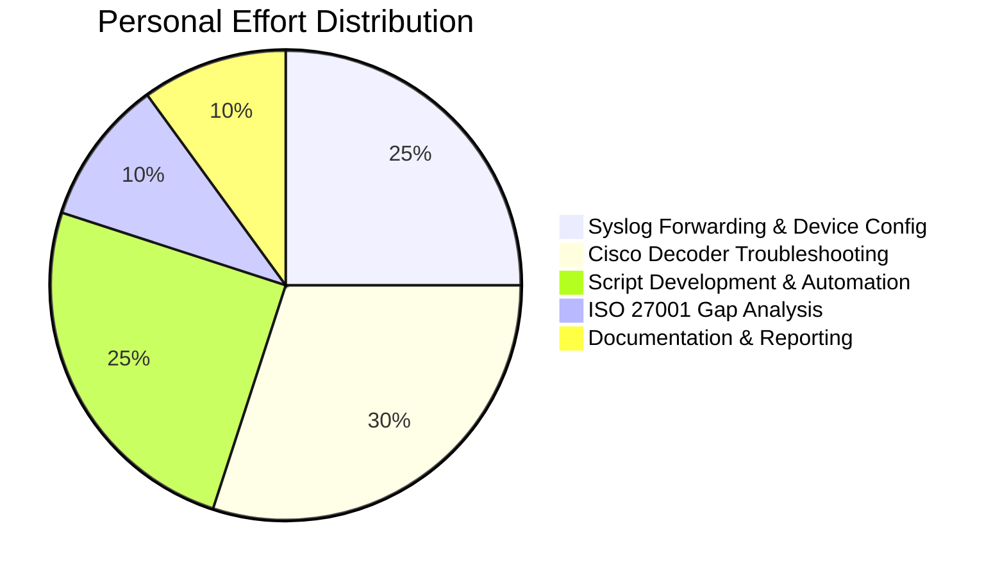
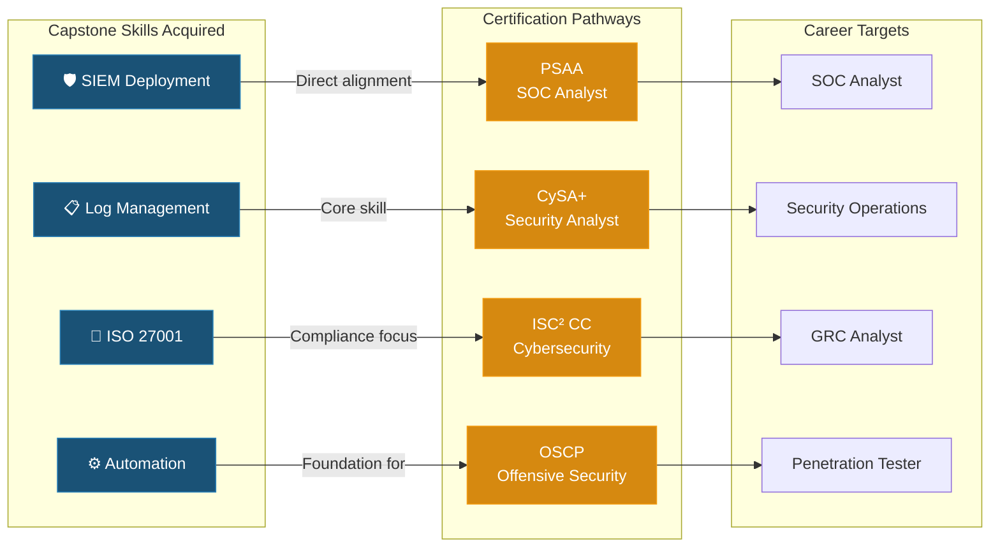

# Individual Reflection --- Cybersecurity Capstone Experience

**Course:** CSC-7307 Cybersecurity Capstone | **Term:** Winter 2025
**Institution:** Cambrian College | **Instructor:** Course Instructor
**Date:** April 2025 (Week 14 Deliverable)

---

## Introduction

This reflection covers my experience in the Winter 2025 Cybersecurity Capstone, working on a real-world engagement with Industry Partner. It was the first time in my studies where the work felt genuinely consequential -- we were not building something for a grade alone, but delivering a product that an actual organization would use. That changed the dynamic of the entire course for me.

---

## My Role and Contributions

I was part of Group 2, responsible for network device integration with the Wazuh SIEM platform. My primary contributions fell into four areas:

**Syslog forwarding and device configuration.** I worked on configuring both Cisco IOSv (via GNS3) and MikroTik RouterOS to forward syslog data to the Wazuh Manager over UDP 514. The MikroTik side was relatively straightforward, but Cisco required more investigation due to how GNS3 handles virtual network interfaces.

**Custom decoder troubleshooting.** I led the effort to diagnose and resolve the Cisco decoder XML parsing errors that blocked log analysis in Wazuh. The community-provided decoder files (0065-cisco-ios_decoders.xml, 0075-cisco-ios_rules.xml) had encoding issues and malformed entries that caused the Wazuh analysis engine to reject certain log patterns. I wrote recovery scripts to fix carriage return and encoding problems, and systematically tested decoder files to isolate which ones were causing failures.

**Wazuh setup automation.** I authored the `wazuh_setup.sh` script that automated the Wazuh deployment process. The script included pre-flight checks for system requirements, XML validation of configuration files, automatic backup of existing configurations before changes, and post-deployment verification to confirm services were running correctly. Writing this script forced me to think about deployment as a repeatable process rather than a one-time activity.

**ISO 27001 gap analysis contributions.** While Group 1 led the ISO compliance work, I contributed to the gap analysis by reviewing Industry Partner's operational controls against the Annex A requirements. This cross-group collaboration gave me exposure to the policy side of cybersecurity, which I had less experience with coming into the course.

---

## Technical Skills Developed

The capstone pushed me to develop several technical skills that I had only touched on in previous courses:

- **SIEM administration.** Before this project, my experience with SIEM tools was limited to running pre-configured labs. Deploying Wazuh from scratch, configuring syslog listeners, and tuning alert rules gave me a much deeper understanding of how these platforms work under the hood.

- **Log management and parsing.** Working with syslog formats, XML decoders, and the Wazuh analysis pipeline taught me how much work goes into making raw log data useful. The Cisco decoder issues, in particular, showed me that log ingestion is rarely as simple as "point the device at the collector."

- **Bash scripting for automation.** The `wazuh_setup.sh` script was the most complex shell script I had written to that point. Handling error conditions, implementing rollback logic, and validating XML configurations gave me practical scripting experience that I can apply to future infrastructure work.

- **Virtualization and networking.** Managing Hyper-V VMs, configuring GNS3, and working within a /20 subnet reinforced my networking fundamentals in a hands-on context.

---

## Professional Skills Developed

Beyond the technical work, the capstone developed several professional skills:

- **Client communication.** Interacting with Industry Mentor at Industry Partner required translating technical details into business-relevant language. Learning to frame updates around what the client cares about -- progress, risks, and outcomes -- is a skill I will carry forward.

- **Team coordination.** Working in a group of seven, split into sub-teams with interdependent deliverables, required clear communication about who was doing what and when. We learned early that parallel work on the same VM without a snapshot strategy was a recipe for lost configurations.

- **Documentation discipline.** Maintaining weekly notes, writing architecture documentation, and creating script READMEs throughout the project reinforced the importance of documenting decisions as they happen, not after the fact.

---

## Challenges and Growth

The most significant challenge I faced was the Cisco decoder troubleshooting. There were several sessions where I was deep in XML files, removing and re-adding decoder entries one at a time to isolate parsing failures. It was tedious and sometimes frustrating, but it taught me a structured approach to debugging complex configurations. The breakthrough -- realizing that encoding and carriage return issues were the root cause rather than logical errors in the decoder rules -- was a good reminder to check the basics before assuming the problem is complicated.

The Wazuh 4.10.1 version instability was also a significant learning moment for the whole team. We had assumed that upgrading to the latest version was the right move, and the experience of watching the dashboard break, alerts disappear, and decoders misfire was a visceral lesson in the value of conservative change management. Rolling back and locking the version was the right call, but it required the confidence to say "the newer version is worse" and act on that conclusion.

---

## Career Impact

This capstone directly connects to the career path I am building. The hands-on SIEM experience is relevant to the Palo Alto Systems Academy (PSAA) certification I completed earlier in the program, and the ISO 27001 exposure complements the ISC2 Certified in Cybersecurity (CC) credential I am pursuing.

More broadly, the capstone gave me a concrete project I can discuss in interviews. Being able to describe a real client engagement -- the technical decisions, the challenges, the outcomes -- carries more weight than listing courses on a resume. The experience of working with an actual organization on their security infrastructure is something I will reference for a long time.

---

## Skills Development Matrix

### Technical Skills

| Skill | Before Capstone | After Capstone | Evidence |
|-------|:--------------:|:--------------:|----------|
| **SIEM Administration** | Beginner — pre-configured labs only | Intermediate — deployed from scratch, tuned rules | Wazuh 4.9.2 deployment, 15+ custom alert rules |
| **Log Management & Parsing** | Minimal — understood concept only | Intermediate — syslog forwarding, decoder troubleshooting | Cisco/MikroTik integration, 2,400 events/day |
| **Bash Scripting** | Basic — simple scripts | Proficient — production automation with error handling | 4 scripts: setup, recovery, healthcheck, version lock |
| **Network Virtualization** | Basic — single VM labs | Intermediate — multi-VM Hyper-V + GNS3 environments | 4-VM lab on /20 subnet |
| **ISO 27001 Compliance** | None | Foundational — gap analysis, policy development | Operations Security Policy, Annex A mapping |
| **XML Debugging** | None | Practical — encoding diagnosis, validation tooling | 12 decoder XML parsing errors resolved |

### Professional Skills

| Skill | Before Capstone | After Capstone | Evidence |
|-------|:--------------:|:--------------:|----------|
| **Client Communication** | Academic only | Practiced — bi-weekly client updates with Industry Partner | Client meetings, progress reports, knowledge transfer |
| **Technical Documentation** | Informal notes | Structured — architecture docs, deployment guides, policies | 6 major project documents authored |
| **Team Coordination** | Small group projects | Cross-functional — 7-person team, 2 sub-groups | Group 2 lead for network device integration |
| **Decision-Making Under Pressure** | Untested | Proven — version rollback decision, decoder workaround | Wazuh 4.10.1 rollback, decoder resolution |

---

## Quantified Contributions



| Metric | Value |
|--------|-------|
| **Scripts authored** | 4 production-grade Bash scripts (~600 lines total) |
| **Decoder issues resolved** | 12 XML parsing errors across community decoder files |
| **Devices integrated** | 2 (Cisco IOSv via GNS3, MikroTik CHR) |
| **Event throughput achieved** | ~2,400 events/day from integrated sources |
| **Script iterations** | 4 major versions before final consolidated suite |
| **Documents contributed to** | 6 (Architecture, Deployment, Findings, ISO Journey, Scripts README, weekly notes) |

---

## Growth Timeline

```mermaid
timeline
    title Technical Growth — Winter 2025 Capstone
    section Weeks 1-3 : Discovery
        : First exposure to Wazuh SIEM
        : Scoping real client engagement
        : Learning Hyper-V lab management
    section Weeks 4-6 : Building
        : Deployed Wazuh 4.9.2 from scratch
        : Wrote first automation script (v1)
        : Encountered Cisco decoder XML errors
    section Weeks 7-9 : Problem-Solving
        : Identified Wazuh 4.10.1 bugs
        : Made version rollback decision
        : Iterated scripts through 4 versions
    section Weeks 10-12 : Maturing
        : Contributed to ISO 27001 gap analysis
        : Consolidated scripts into final suite
        : Led documentation of technical findings
    section Weeks 13-14 : Delivering
        : Completed client knowledge transfer
        : Delivered final presentation
        : Produced portfolio-grade documentation
```

---

## Key Takeaways

1. **Real-world projects are messy.** Lab exercises have clean boundaries and expected outcomes. Client engagements have ambiguity, unexpected technical issues, and evolving requirements. Learning to navigate that messiness is the most valuable skill the capstone taught me.

2. **Version management matters.** The Wazuh 4.10.1 experience will stay with me. Always test in isolation. Always have a rollback plan. Never assume the latest version is the best version.

3. **Documentation is a deliverable, not an afterthought.** The documentation we produced for Industry Partner was as important as the deployed SIEM. Without it, the technical work would have limited long-term value for the client.

4. **Cross-functional exposure is valuable.** Contributing to both the technical integration (Group 2) and the ISO compliance work (Group 1) gave me a more complete picture of what cybersecurity consulting looks like in practice.

5. **Automation pays off.** The time I invested in the `wazuh_setup.sh` script saved the team significant effort during testing and redeployment. Building repeatable processes is always worth the upfront investment.

---

## Career Alignment


