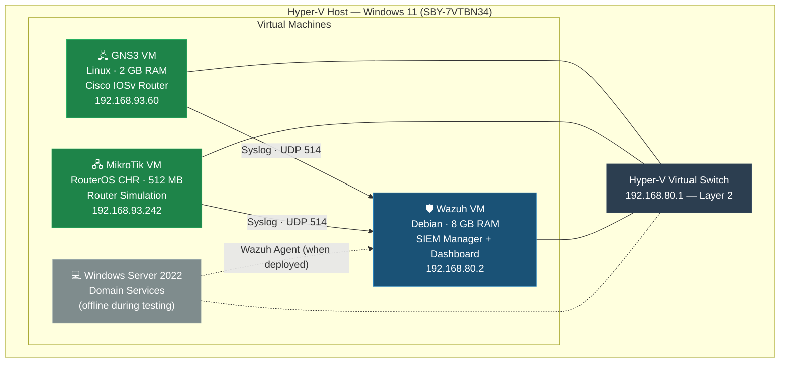
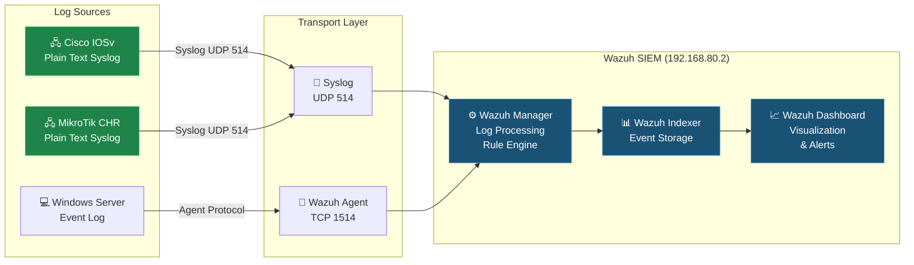

# Virtual Lab Architecture

## Host Environment

| Component | Specification |
|-----------|--------------|
| **Hypervisor** | Hyper-V on Windows 11 |
| **Host Machine** | SBY-7VTBN34 |
| **Network** | Hyper-V Virtual Switch (Layer 2) |
| **Subnet** | 192.168.80.0/20 (4,094 usable hosts) |

---

## Virtual Machine Inventory

| VM | OS | RAM | Role | IP Address |
|----|----|-----|------|-----------|
| **GNS3 VM** | Linux | 2 GB | Network emulation — Cisco IOSv device simulation | — |
| **MikroTik VM** | RouterOS (CHR) | 512 MB | Router simulation — traffic generation and log forwarding | 192.168.93.242 |
| **Wazuh VM** | Debian | 8 GB | SIEM — log collection, processing, and analysis | 192.168.80.2 |
| **Windows Server 2022** | Windows Server | — | Domain services (powered off during initial testing) | — |

---

## Network Topology

### Rendered Diagram



### ASCII Reference

```
                        ┌──────────────────────┐
                        │   Hyper-V Host        │
                        │   Windows 11          │
                        │   SBY-7VTBN34         │
                        └──────────┬───────────┘
                                   │
                    ┌──────────────┴──────────────┐
                    │    Hyper-V Virtual Switch    │
                    │    192.168.80.1 (Gateway)    │
                    │    Layer 2 Switch Mode       │
                    └──┬────┬────┬────┬──────────┘
                       │    │    │    │
              ┌────────┘    │    │    └────────┐
              │             │    │             │
    ┌─────────┴──┐  ┌──────┴─┐  ┌┴──────────┐  ┌┴──────────┐
    │  GNS3 VM   │  │MikroTik│  │  Wazuh VM │  │ Win Srv   │
    │            │  │  CHR   │  │  Debian   │  │  2022     │
    │ Cisco IOSv │  │        │  │           │  │ (offline) │
    │ Router     │  │ Router │  │ Manager + │  │           │
    │            │  │        │  │ Dashboard │  │           │
    │ .93.60     │  │.93.242 │  │ .80.2     │  │    —      │
    └─────┬──────┘  └───┬────┘  └─────┬─────┘  └───────────┘
          │              │              │
          │   Syslog     │   Syslog     │
          │   UDP 514    │   UDP 514    │
          └──────────────┴──────►───────┘
                    Log Forwarding
```

---

## Subnet Design

| Property | Value |
|----------|-------|
| **Network Address** | 192.168.80.0 |
| **Subnet Mask** | 255.255.240.0 (/20) |
| **Usable Host Range** | 192.168.80.1 – 192.168.95.254 |
| **Broadcast Address** | 192.168.95.255 |
| **Total Usable Hosts** | 4,094 |

> **Design Note:** The /20 subnet was chosen to accommodate all VMs (including those using 192.168.93.x addresses) on a single flat network, eliminating the need for inter-subnet routing.

---

## Data Flow

### Log Collection Pipeline — Rendered



### Log Collection Pipeline — Text Reference

```
Cisco IOSv Router ──► Syslog (UDP 514) ──► Wazuh Manager ──► Wazuh Dashboard
MikroTik Router   ──► Syslog (UDP 514) ──► Wazuh Manager ──► Wazuh Dashboard
Windows Server    ──► Wazuh Agent      ──► Wazuh Manager ──► Wazuh Dashboard
```

### Log Format Considerations

| Source | Native Format | Integration Method |
|--------|--------------|-------------------|
| Cisco IOSv | Plain text syslog | Direct syslog → Wazuh ossec.conf `<syslog>` listener |
| MikroTik | Plain text syslog | Direct syslog → Wazuh ossec.conf `<syslog>` listener |
| Windows Server | Windows Event Log | Wazuh Agent (when deployed) |

> **Challenge:** Different native log formats (plain text, JSON, syslog variations) require custom decoders or pre-processing. See [Wazuh Deployment](WAZUH_DEPLOYMENT.md) for decoder details.

---

## Known Considerations

### Hyper-V Network Adapter IP Randomization

An observed quirk where the Hyper-V network adapter can randomize its IP subnet upon host reboot. This affects VMs (particularly Wazuh) if their static IPs fall outside the new subnet range.

**Mitigation:**
- Verify network adapter settings after host reboots
- Use static IP assignments on the Hyper-V virtual switch
- Consider DHCP reservations for critical VMs

### VM Snapshot Strategy

Snapshots are used extensively for safe experimentation:
- Pre-change snapshots before Wazuh configuration modifications
- Version-labeled snapshots (e.g., "Wazuh 4.9.2 — stable baseline")
- Team coordination to avoid overwriting shared snapshots
