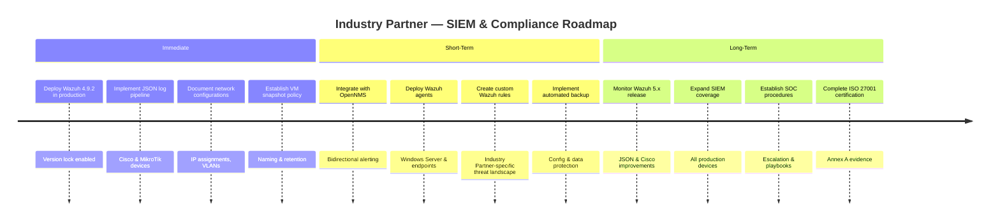

# Findings & Recommendations

## Technical Findings

### 1. Wazuh Version Stability

**Finding:** Wazuh 4.10.1 contains several critical bugs affecting production reliability.

**Evidence:**
- Cisco ASA log misclassification (decoded under `cisco-ios` instead of `cisco-asa`)
- Vulnerability Detector producing blank data due to index template incompatibilities
- Alerts generated in `alerts.json` but not rendered in the Kibana dashboard
- Docker and manual upgrades from 4.9.x creating broken states

**Impact:** Organizations relying on Wazuh 4.10.1 may experience missed security events, incorrect alert classification, and service outages during upgrades.

**Recommendation:** Lock Wazuh to version 4.9.2 using `yum-plugin-versionlock` until Wazuh 5.x addresses these issues. Monitor the [Wazuh GitHub repository](https://github.com/wazuh/wazuh) for patch releases.

---

### 2. Cisco Decoder XML Parsing

**Finding:** Community-provided Cisco XML decoder files contain parsing errors that prevent Wazuh from loading.

**Details:**
- Files affected: `0065-cisco-ios_decoders.xml`, `0075-cisco-ios_rules.xml`
- Encoding issues and carriage returns cause XML validation failures
- The Wazuh team has acknowledged gaps in Cisco ASA log parsing

**Recommendation:** Implement a JSON-based log ingestion pipeline using Rsyslog or Logstash to pre-process Cisco logs before Wazuh ingestion. This reduces dependency on XML decoders and provides more reliable parsing.

---

### 3. JSON Log Pipeline Architecture

**Finding:** Converting device logs to JSON format before Wazuh ingestion significantly reduces operational complexity.

**Benefits:**
| Aspect | Traditional (Syslog) | JSON Pipeline |
|--------|----------------------|---------------|
| Decoder Dependency | High (vendor-specific XML) | Low (generic JSON parser) |
| Format Consistency | Variable by vendor | Uniform JSON structure |
| Wazuh 5.x Readiness | May require decoder rewrites | Native JSON improvements expected |
| Troubleshooting | Complex (multi-layer parsing) | Simplified (structured data) |

**Implementation:**

---

### 4. Hyper-V Network Stability

**Finding:** Hyper-V virtual switch may randomize its IP subnet upon host reboot, breaking VM connectivity.

**Impact:** The Wazuh VM and other devices lose network connectivity if their static IPs fall outside the newly assigned subnet.

**Recommendation:**
- Configure static IP assignments on the Hyper-V virtual switch
- Implement startup scripts to verify and correct network configuration
- Document the expected subnet configuration for operational reference

---

### 5. Environment Isolation

**Finding:** Maintaining separate test environments proved critical for safe experimentation.

**Benefits Observed:**
- Prevented accidental overwrite of other teams' work
- Enabled parallel testing of different Wazuh versions
- Provided clean baselines for troubleshooting
- Allowed aggressive testing (decoder removal, configuration changes) without production risk

**Recommendation:** Establish a formal development/staging/production environment separation aligned with ISO 27001 requirements for environment segregation.

---

## Strategic Recommendations for Industry Partner

### Implementation Roadmap

### Immediate Actions

1. **Deploy Wazuh 4.9.2 in production** with version locking enabled
2. **Implement the JSON log pipeline** for Cisco and MikroTik devices
3. **Document all network configurations** including IP assignments and VLAN settings
4. **Establish a VM snapshot policy** with naming conventions and retention schedules

### Short-Term Improvements

5. **Integrate with OpenNMS** — Evaluate bidirectional alerting between Wazuh and the existing OpenNMS platform
6. **Deploy Wazuh agents** on Windows Server 2022 and other endpoints
7. **Create custom Wazuh rules** tailored to Industry Partner's specific infrastructure and threat landscape
8. **Implement automated backup** of Wazuh configuration and data

### Long-Term Vision

9. **Monitor Wazuh 5.x release** for improved JSON handling and Cisco decoder fixes
10. **Expand SIEM coverage** to include all production network devices and endpoints
11. **Establish SOC procedures** — Define escalation paths, response playbooks, and KPIs
12. **Complete ISO 27001 certification** — Use SIEM deployment as evidence for Annex A technical controls
