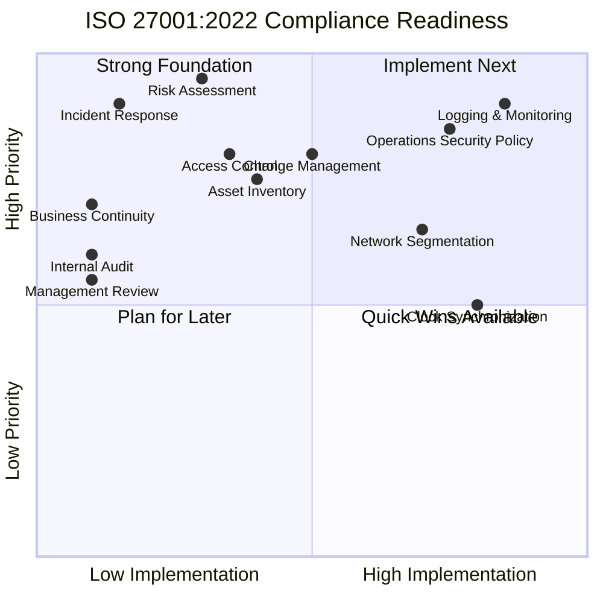
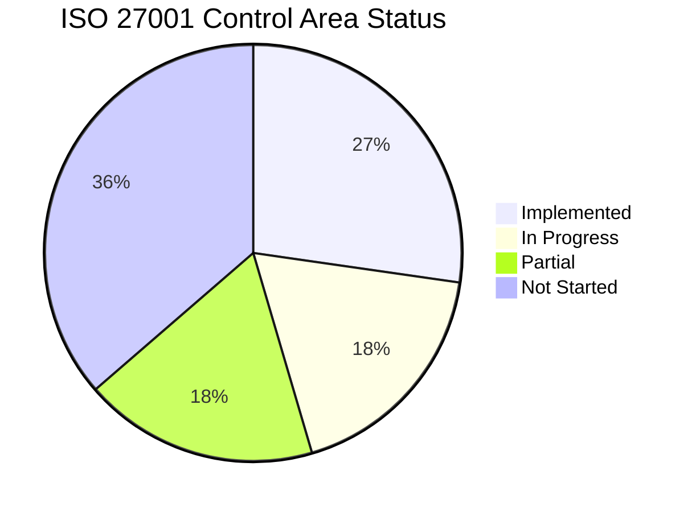

# ISO 27001:2022 — Compliance Journey

## Background

**Industry Partner.** is pursuing certification under **ISO/IEC 27001:2022**, the international standard for information security management systems (ISMS). This capstone project continued the compliance journey initiated by the Fall 2024 capstone group.

---

## ISO 27001:2022 Overview

ISO/IEC 27001:2022 specifies requirements for establishing, implementing, maintaining, and continually improving an ISMS within the context of the organization. Key elements include:

- **Risk Assessment** — Systematic identification and evaluation of information security risks
- **Annex A Controls** — 93 controls organized across 4 themes (Organizational, People, Physical, Technological)
- **Continual Improvement** — Plan-Do-Check-Act (PDCA) cycle for ongoing security posture enhancement

---

## Fall 2024 Foundation

The Fall 2024 capstone group established:
- Initial gap analysis against ISO 27001 requirements
- Preliminary documentation framework
- Identification of key areas requiring attention

---

## Winter 2025 Contributions

### Operations Security Policy

Developed a comprehensive **Operations Security Policy** aligned with ISO/IEC 27001:2022 Annex A controls, addressing:

| Control Area | Coverage |
|-------------|----------|
| **A.8 — Technological Controls** | Logging, monitoring, and event management |
| **Change Management** | Procedures for system and configuration changes |
| **Capacity Management** | Resource monitoring and planning |
| **Separation of Environments** | Development, testing, and production isolation |
| **Malware Protection** | Endpoint security and anti-malware measures |
| **Backup** | Data backup procedures and verification |
| **Logging & Monitoring** | Centralized SIEM deployment (Wazuh) |
| **Clock Synchronization** | NTP configuration for log correlation |

### SIEM as an ISO 27001 Control

The Wazuh SIEM deployment directly addresses several Annex A requirements:

| ISO Control | Implementation |
|------------|----------------|
| **A.8.15 — Logging** | Centralized log collection from all network devices |
| **A.8.16 — Monitoring Activities** | Real-time alerting and dashboard monitoring |
| **A.8.17 — Clock Synchronization** | NTP-based timestamps for log correlation |
| **A.5.24 — Incident Management** | Alert-driven incident detection workflow |
| **A.5.25 — Assessment of Security Events** | Wazuh rule engine for event classification |

---

## Gap Analysis Observations

### Scoring Methodology

The compliance readiness visualization uses a two-axis scoring system:

| Axis | Meaning | Scoring Basis |
|------|---------|--------------|
| **Implementation (x-axis)** | Percentage of control requirements currently met (0–100%) | Based on documented evidence: policies written, tools deployed, procedures formalized |
| **Priority (y-axis)** | Business impact if the control is not implemented (0–100%) | Based on Industry Partner's risk profile: client-facing services, regulatory exposure, incident likelihood |

**Example:** *Logging & Monitoring [0.85, 0.90]* — 85% implemented (Wazuh deployed with multi-vendor collection, but alert tuning ongoing) and 90% priority (critical for incident detection in a telecom serving government clients).

### Compliance Readiness Visualization

### Gap Analysis Summary

### Areas of Strength

- **Technical Controls** — Wazuh deployment provides strong logging and monitoring foundation
- **Network Segmentation** — Virtual lab demonstrates segmentation principles
- **Documentation** — Operational procedures being formalized

### Areas Requiring Further Attention

| Area | Status | Notes | Remediation Owner | Evidence Required |
|------|--------|-------|------------------|-------------------|
| **Risk Assessment** | In Progress | Formal risk register needed | IT Security Manager | Documented risk register with likelihood/impact scores |
| **Asset Inventory** | Partial | VM inventory documented; physical assets need cataloging | Systems Administrator | Complete asset register (hardware, software, data) |
| **Access Control** | Partial | Need formal access control policy | IT Security Manager | RBAC policy document, access review logs |
| **Incident Response Plan** | Not Started | Framework needed beyond SIEM alerting | IT Security Manager | Incident response playbook, escalation matrix |
| **Business Continuity** | Not Started | Disaster recovery procedures required | IT Security Manager | BCP document, recovery time objectives |
| **Internal Audit** | Not Started | Audit schedule and procedures needed | IT Security Manager | Audit schedule, checklist templates |
| **Management Review** | Not Started | Regular review process to be established | Executive Management | Meeting minutes, ISMS review reports |

### Evidence Mapping — Existing Artifacts

The following capstone artifacts provide direct evidence for ISO 27001 compliance audit purposes:

| ISO Control | Evidence Artifact | Location |
|------------|-------------------|----------|
| **A.8.15 — Logging** | Wazuh syslog configuration (`ossec.conf`) | [WAZUH_DEPLOYMENT.md](WAZUH_DEPLOYMENT.md) |
| **A.8.15 — Logging** | Automated deployment script with log validation | [`wazuh_setup.sh`](scripts/wazuh_setup.sh) |
| **A.8.16 — Monitoring** | 15+ custom alert rules, dashboard configuration | [WAZUH_DEPLOYMENT.md](WAZUH_DEPLOYMENT.md) |
| **A.8.16 — Monitoring** | 9-point health diagnostic script | [`wazuh_healthcheck.sh`](scripts/wazuh_healthcheck.sh) |
| **A.8.17 — Clock Sync** | NTP configuration documented in policy | [OPERATIONS_SECURITY_POLICY.md](OPERATIONS_SECURITY_POLICY.md) §10 |
| **A.5.24 — Incident Mgmt** | Alert-driven detection workflow, escalation procedures | [OPERATIONS_SECURITY_POLICY.md](OPERATIONS_SECURITY_POLICY.md) §13 |
| **A.5.25 — Event Assessment** | Wazuh rule engine configuration, event classification | [WAZUH_DEPLOYMENT.md](WAZUH_DEPLOYMENT.md) |
| **A.8.32 — Change Mgmt** | Change request process, rollback procedures | [OPERATIONS_SECURITY_POLICY.md](OPERATIONS_SECURITY_POLICY.md) §4 |
| **A.8.6 — Capacity Mgmt** | Resource thresholds, monitoring procedures | [OPERATIONS_SECURITY_POLICY.md](OPERATIONS_SECURITY_POLICY.md) §5 |
| **A.8.31 — Environment Sep.** | Dev/staging/prod isolation controls | [OPERATIONS_SECURITY_POLICY.md](OPERATIONS_SECURITY_POLICY.md) §6 |
| **A.8.7 — Malware Protection** | Endpoint security integration with Wazuh | [OPERATIONS_SECURITY_POLICY.md](OPERATIONS_SECURITY_POLICY.md) §7 |
| **A.8.13 — Backup** | Backup schedule, retention, verification | [OPERATIONS_SECURITY_POLICY.md](OPERATIONS_SECURITY_POLICY.md) §8 |
| **A.8.9 — Config Mgmt** | Version lock, XML validation, backup-before-change | [`wazuh_version_lock.sh`](scripts/wazuh_version_lock.sh), [`wazuh_setup.sh`](scripts/wazuh_setup.sh) |
| **Operations Security** | Comprehensive operations security policy | [OPERATIONS_SECURITY_POLICY.md](OPERATIONS_SECURITY_POLICY.md) |

---

## Recommendations for Industry Partner

### Short-Term (0–3 months)

1. **Formalize the Risk Register** — Document identified risks, likelihood, impact, and treatment plans
2. **Complete Asset Inventory** — Catalog all information assets including hardware, software, and data
3. **Implement Access Control Policy** — Define role-based access for all systems

### Medium-Term (3–6 months)

4. **Develop Incident Response Plan** — Build on Wazuh alerting to create a full incident response procedure
5. **Establish Change Management** — Formal process for all infrastructure and configuration changes
6. **Begin Internal Audit Preparation** — Train staff on audit procedures and schedule first internal audit

### Long-Term (6–12 months)

7. **Engage Certification Body** — Select an accredited certification body for Stage 1 and Stage 2 audits
8. **Management Review Cycle** — Establish quarterly ISMS management reviews
9. **Continual Improvement** — Implement PDCA cycle for ongoing security posture enhancement

---

## References

- [ISO/IEC 27001:2022](https://www.iso.org/standard/27001) — Information Security Management Systems
- [Wazuh — Regulatory Compliance](https://documentation.wazuh.com/current/compliance/index.html) — Wazuh compliance monitoring features
- [Operations Security Policy](OPERATIONS_SECURITY_POLICY.md) — Full policy document developed for Industry Partner
