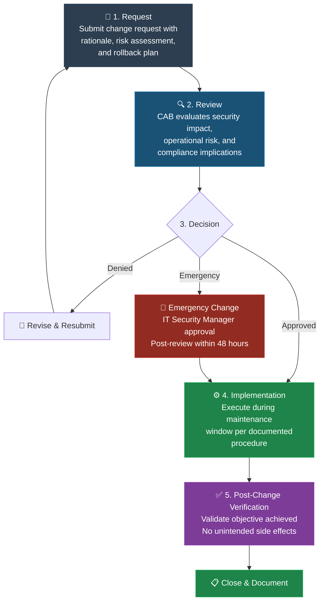
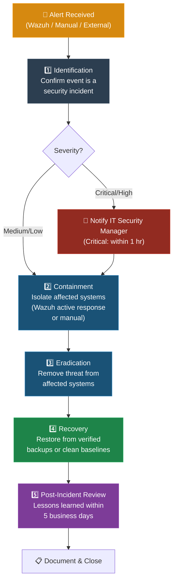

# Operations Security Policy

## Industry Partner.

### Document Control

| Field | Detail |
|-------|--------|
| **Document Title** | Operations Security Policy |
| **Document ID** | STG-ISMS-POL-008 |
| **Classification** | Internal |
| **Owner** | IT Security — Industry Partner. |

| Version | Date | Author | Reviewer | Status |
|---------|------|--------|----------|--------|
| 1.0 | 2025-03-15 | Capstone Team — CSC-7307, Cambrian College | Industry Partner IT Management | Approved |
| 0.2 | 2025-02-28 | Capstone Team — CSC-7307 | Capstone Faculty Advisor | Review |
| 0.1 | 2025-02-10 | Capstone Team — CSC-7307 | — | Draft |

---

## 1. Purpose & Scope

### 1.1 Purpose

This policy establishes the operational security requirements for Industry Partner. to ensure the confidentiality, integrity, and availability of information processing facilities. It defines the procedures and responsibilities necessary to maintain a secure operational environment in alignment with the ISO/IEC 27001:2022 Information Security Management System (ISMS).

### 1.2 Scope

This policy applies to:

- All information processing facilities owned or operated by Industry Partner.
- Network infrastructure serving various clients across Canada
- Virtualized environments including the Hyper-V host (SBY-7VTBN34) and all managed virtual machines
- The Wazuh 4.9.2 SIEM platform and all integrated log sources
- Cisco and MikroTik network devices under Industry Partner management
- All employees, contractors, and third parties with access to Industry Partner operational systems

### 1.3 Exclusions

Client-owned equipment and systems not under direct Industry Partner management are excluded unless covered by a separate service-level agreement.

---

## 2. Definitions

| Term | Definition |
|------|-----------|
| **ISMS** | Information Security Management System — the framework of policies and procedures for managing information security risks |
| **SIEM** | Security Information and Event Management — a platform that collects, correlates, and analyzes security event data from multiple sources |
| **Wazuh** | The open-source SIEM platform (version 4.9.2) deployed by Industry Partner for centralized log collection, threat detection, and compliance monitoring |
| **NTP** | Network Time Protocol — used to synchronize system clocks across all devices for accurate log correlation |
| **VM** | Virtual Machine — an isolated computing environment running on the Hyper-V hypervisor |
| **CHR** | Cloud Hosted Router — MikroTik's virtual router appliance deployed as a VM for routing and traffic generation |
| **ossec.conf** | The primary Wazuh Manager configuration file located at `/var/ossec/etc/ossec.conf` |
| **Change Advisory Board (CAB)** | The group responsible for evaluating and approving proposed changes to production systems |

---

## 3. Operational Procedures & Responsibilities

### 3.1 Roles

| Role | Responsibility |
|------|---------------|
| **IT Security Manager** | Policy ownership, ISMS coordination, incident escalation authority |
| **Systems Administrator** | Day-to-day operations, VM management, Wazuh administration, backup execution |
| **Network Administrator** | Cisco and MikroTik device management, syslog configuration, NTP maintenance |
| **Change Advisory Board** | Review and approval of changes to production infrastructure |
| **All Personnel** | Compliance with this policy, reporting of security events |

### 3.2 Documentation Requirements

All operational procedures must be documented, maintained in version control, and reviewed on the schedule defined in Section 15 of this policy. Procedures must include step-by-step instructions sufficient for a qualified operator to execute without additional guidance.

---

## 4. Change Management (A.8.32)

### 4.1 Change Request Process

All changes to production systems, network configurations, and security tooling must follow a formal change management process:

1. **Request** — Submit a change request describing the proposed modification, rationale, affected systems, risk assessment, and rollback plan
2. **Review** — The CAB reviews the request for security impact, operational risk, and compliance implications
3. **Approval** — The CAB grants or denies approval; emergency changes require post-implementation review within 48 hours
4. **Implementation** — Execute the change during an approved maintenance window, following the documented procedure
5. **Post-Change Verification** — Validate that the change achieved its objective and no unintended side effects occurred

### 4.2 Change Categories

| Category | Approval Required | Examples |
|----------|------------------|---------|
| **Standard** | Pre-approved | Routine patching, scheduled VM snapshots, log rotation |
| **Normal** | CAB approval | Wazuh configuration changes, firewall rule modifications, new syslog source integration |
| **Emergency** | IT Security Manager | Active incident response, critical vulnerability remediation |

### 4.3 Configuration Management

- All Wazuh configuration changes to `ossec.conf` must be preceded by a timestamped backup
- XML validation via `xmllint` and Wazuh validation via `/var/ossec/bin/wazuh-control validate` are mandatory before service restart
- Automatic rollback must be available for all configuration changes (as implemented in the `wazuh_setup.sh` deployment script)

---

## 5. Capacity Management (A.8.6)

### 5.1 Resource Monitoring

The following resources must be continuously monitored:

| Resource | Threshold | Action |
|----------|-----------|--------|
| **Wazuh VM RAM** (8 GB allocated) | 85% utilization | Investigate log volume; consider increasing allocation |
| **Wazuh VM Disk** | 80% utilization | Execute log rotation; review retention policy |
| **Hyper-V Host CPU** | 90% sustained for 15 minutes | Identify resource-intensive VMs; defer non-critical workloads |
| **Hyper-V Host Disk** | 85% utilization | Archive old VM snapshots; expand storage |
| **Syslog Queue (UDP 514)** | Dropped packets detected | Investigate log source volume; tune Wazuh buffer settings |

### 5.2 Capacity Planning

- Review resource utilization trends quarterly
- Plan capacity increases at least 30 days before projected threshold breaches
- Account for growth when onboarding new log sources or deploying additional Wazuh agents
- Document all capacity decisions in the ISMS records

---

## 6. Separation of Environments (A.8.31)

### 6.1 Environment Classification

| Environment | Purpose | Restrictions |
|-------------|---------|-------------|
| **Production** | Live operational systems serving clients | Changes only via approved change management process |
| **Staging** | Pre-production validation of changes | Must mirror production configuration; no client data |
| **Development/Test** | Experimentation, PoC, troubleshooting | Isolated network segment; aggressive testing permitted |

### 6.2 Hyper-V Environment Controls

- Each environment must use a separate Hyper-V virtual switch or VLAN to enforce network isolation
- VM snapshots must be labeled with environment designation (e.g., "Wazuh 4.9.2 — stable baseline — PROD")
- Promoting a configuration from test to production requires a documented change request and CAB approval
- Development environments must not have network connectivity to production systems
- Team members must coordinate snapshot management to prevent accidental overwrites of shared baselines

### 6.3 Data Separation

- Production data must not be copied to development or test environments without explicit authorization and appropriate anonymization
- Test log data should be generated synthetically or sourced from non-sensitive device output

---

## 7. Malware Protection (A.8.7)

### 7.1 Endpoint Protection Requirements

- All Windows-based systems (including Windows Server 2022 VMs) must run an approved endpoint protection solution with real-time scanning enabled
- Signature databases must be updated at least daily
- Full system scans must be scheduled weekly during off-peak hours

### 7.2 Wazuh Integration

- The Wazuh rootcheck and syscheck modules must be enabled on all systems running the Wazuh agent
- File integrity monitoring (FIM) must cover critical system directories and Wazuh configuration files
- Wazuh active response rules must be configured to isolate endpoints upon detection of confirmed malware indicators

### 7.3 Network Device Considerations

- Cisco and MikroTik devices do not support traditional endpoint protection; compensating controls include firmware integrity verification, access control lists, and log monitoring via the Wazuh SIEM for anomalous behavior

---

## 8. Backup (A.8.13)

### 8.1 Backup Schedule

| Asset | Method | Frequency | Retention |
|-------|--------|-----------|-----------|
| **Wazuh ossec.conf** | Timestamped file copy (`wazuh_setup.sh` automated backup) | Before every configuration change | 90 days |
| **Wazuh alert data** | File-level backup of `/var/ossec/logs/alerts/` | Daily | 180 days |
| **Wazuh rules and decoders** | File-level backup of `/var/ossec/etc/rules/` and `/var/ossec/etc/decoders/` | Weekly | 90 days |
| **VM Snapshots** | Hyper-V checkpoint | Before major changes; weekly for production VMs | 30 days (rolling) |
| **Network device configs** | Export running-config (Cisco) / export (MikroTik) | Weekly and before changes | 90 days |

### 8.2 Backup Verification

- Restore tests must be conducted quarterly for each backup category
- VM snapshot restoration must be verified to confirm boot integrity and network connectivity
- Wazuh configuration restores must be validated with `xmllint` and `wazuh-control validate`
- Backup verification results must be documented and retained as ISMS evidence

### 8.3 Offsite Storage

- Critical backups (VM exports, Wazuh configuration archives) must be stored on a separate physical medium or secure offsite location
- Backup media must be encrypted in transit and at rest

---

## 9. Logging & Monitoring (A.8.15, A.8.16)

### 9.1 Centralized SIEM

All security-relevant events must be forwarded to the Wazuh 4.9.2 SIEM for centralized collection and analysis.

### 9.2 Log Sources

| Source | Protocol | Port | Integration |
|--------|----------|------|-------------|
| Cisco IOSv Router | Syslog (UDP) | 514 | Direct syslog to Wazuh `<syslog>` listener |
| MikroTik CHR | Syslog (UDP) | 514 | Direct syslog to Wazuh `<syslog>` listener |
| Windows Server 2022 | Wazuh Agent | 1514 | Wazuh agent reporting to Wazuh Manager |
| Hyper-V Host | Wazuh Agent | 1514 | Wazuh agent reporting to Wazuh Manager |

### 9.3 Log Retention

| Log Type | Retention Period | Storage Location |
|----------|-----------------|-----------------|
| Wazuh alerts (`alerts.log`, `alerts.json`) | 180 days online, 1 year archived | Wazuh VM `/var/ossec/logs/alerts/` |
| Wazuh operational logs (`ossec.log`) | 90 days | Wazuh VM `/var/ossec/logs/` |
| Network device syslog (raw) | 90 days | Wazuh VM (post-ingestion) |
| Audit logs | 1 year | Secure archive |

### 9.4 Monitoring & Review Procedures

- The Wazuh Dashboard must be reviewed by the Systems Administrator at least once per business day
- High-severity alerts (Wazuh rule level ≥ 10) must trigger immediate notification to the IT Security Manager
- Medium-severity alerts (Wazuh rule level 7–9) must be reviewed within 4 business hours
- Weekly log review summaries must be prepared and retained as ISMS evidence
- Wazuh health checks (`systemctl status wazuh-manager`, port verification on UDP 514, process verification) must be performed daily

### 9.5 Alert Response

Upon receipt of a Wazuh alert:

1. Acknowledge the alert in the Wazuh Dashboard
2. Classify the event per the severity matrix in Section 9.4
3. Investigate the source event and correlated data
4. Escalate to incident response if confirmed as a security incident (see Section 14)
5. Document the disposition of the alert

---

## 10. Clock Synchronization (A.8.17)

### 10.1 NTP Requirements

All systems participating in log collection and analysis must synchronize to a common, authoritative NTP source to ensure accurate event correlation.

### 10.2 Configuration Standards

| System | NTP Source | Sync Interval |
|--------|-----------|---------------|
| Wazuh VM (Debian) | `pool.ntp.org` (or designated internal NTP server) | Default `ntpd` / `systemd-timesyncd` interval |
| Cisco IOSv Router | Wazuh VM or upstream NTP server | 60 seconds |
| MikroTik CHR | Wazuh VM or upstream NTP server | 60 seconds |
| Windows Server 2022 | Domain controller or `time.windows.com` | Default W32Time interval |
| Hyper-V Host | `time.windows.com` or corporate NTP | Default W32Time interval |

### 10.3 Verification

- NTP synchronization status must be verified as part of daily health checks
- Maximum acceptable clock drift across all systems is ±1 second
- Clock synchronization failures must be treated as operational incidents and resolved within 4 hours

---

## 11. Vulnerability Management (A.8.8)

### 11.1 Vulnerability Detection

- The Wazuh Vulnerability Detector module must be enabled and configured to scan all agent-enrolled systems
- Vulnerability feeds (CVE databases) must be updated at least daily
- Network device firmware versions must be tracked and compared against vendor security advisories monthly

### 11.2 Patching Procedures

| Priority | Timeframe | Criteria |
|----------|-----------|----------|
| **Critical** | 72 hours | Actively exploited or CVSS ≥ 9.0 |
| **High** | 14 days | CVSS 7.0–8.9, no known active exploitation |
| **Medium** | 30 days | CVSS 4.0–6.9 |
| **Low** | Next maintenance cycle | CVSS < 4.0 |

### 11.3 Version Management

- Wazuh must remain locked at version 4.9.2 via `yum-plugin-versionlock` until a successor version has been validated in the staging environment
- All version upgrades must be tested in the development environment, promoted to staging for validation, and approved by the CAB before production deployment
- Version upgrade testing must specifically verify Cisco decoder compatibility, Vulnerability Detector functionality, and Dashboard alert rendering

---

## 12. Technical Compliance Checks

### 12.1 Regular Audits

| Check | Frequency | Method |
|-------|-----------|--------|
| Wazuh configuration validation | Before every change and weekly | `xmllint` + `/var/ossec/bin/wazuh-control validate` |
| Syslog reception verification | Daily | `netstat -tuln \| grep :514` + dashboard event review |
| Wazuh service health | Daily | `systemctl status wazuh-manager` + process verification |
| Firewall rule review | Monthly | Export and review ACLs on Cisco and MikroTik devices |
| User access review | Quarterly | Verify active accounts and privilege levels on all systems |
| Backup integrity | Quarterly | Restore test for each backup category (see Section 8.2) |
| NTP synchronization audit | Monthly | Verify clock offset on all devices (see Section 10.3) |

### 12.2 Configuration Baseline

- A documented configuration baseline must be maintained for all production systems
- Deviations from baseline detected during audits must be investigated and resolved via the change management process or formally accepted as exceptions with documented risk acceptance

---

## 13. Incident Response

### 13.1 Detection

Security incidents are primarily detected through:

- Wazuh real-time alerting (rule-based detection engine)
- Wazuh file integrity monitoring (syscheck)
- Wazuh rootcheck and anomaly detection
- Manual observation during daily dashboard reviews
- Reports from personnel or external parties

### 13.2 Classification

| Severity | Criteria | Response Time |
|----------|----------|---------------|
| **Critical** | Active data breach, ransomware, or service outage affecting clients | Immediate (within 1 hour) |
| **High** | Confirmed unauthorized access, malware detection, or significant policy violation | Within 4 hours |
| **Medium** | Suspicious activity, failed intrusion attempt, or minor policy violation | Within 1 business day |
| **Low** | Informational events, minor anomalies requiring investigation | Within 5 business days |

### 13.3 Response Procedure

1. **Identification** — Confirm the event is a security incident via Wazuh alert data and correlated evidence
2. **Containment** — Isolate affected systems to prevent further impact (Wazuh active response or manual intervention)
3. **Eradication** — Remove the threat from affected systems
4. **Recovery** — Restore systems to normal operation from verified backups or clean baselines
5. **Post-Incident Review** — Conduct a lessons-learned review within 5 business days of incident closure

### 13.4 Escalation

- The IT Security Manager must be notified of all Critical and High severity incidents
- Industry Partner executive management must be notified of all Critical incidents within 2 hours
- Regulatory notification obligations (where applicable) must be fulfilled within statutory timeframes

---

## 14. Policy Review

### 14.1 Review Schedule

This policy must be reviewed and, if necessary, updated:

- **Annually** — As part of the ISMS management review cycle
- **After a significant security incident** — To incorporate lessons learned
- **After major infrastructure changes** — Including new system deployments, network redesigns, or SIEM platform upgrades
- **Upon changes to regulatory or contractual requirements** — Including updates to ISO 27001 or applicable telecommunications regulations

### 14.2 Approval Authority

| Action | Authority |
|--------|-----------|
| Minor editorial corrections | IT Security Manager |
| Procedural updates | IT Security Manager with CAB review |
| Policy scope or control changes | Industry Partner executive management |

### 14.3 Distribution

Approved versions of this policy must be communicated to all personnel within scope and made available through the ISMS document management system. Superseded versions must be archived and clearly marked as obsolete.

---

## Appendix A — ISO 27001:2022 Control Mapping

| Policy Section | ISO 27001:2022 Control | Control Title |
|---------------|----------------------|---------------|
| 3 — Operational Procedures & Responsibilities | A.5.37 | Documented Operating Procedures |
| 4 — Change Management | A.8.32 | Change Management |
| 5 — Capacity Management | A.8.6 | Capacity Management |
| 6 — Separation of Environments | A.8.31 | Separation of Development, Test and Production Environments |
| 7 — Malware Protection | A.8.7 | Protection Against Malware |
| 8 — Backup | A.8.13 | Information Backup |
| 9 — Logging & Monitoring | A.8.15 | Logging |
| 9 — Logging & Monitoring | A.8.16 | Monitoring Activities |
| 10 — Clock Synchronization | A.8.17 | Clock Synchronization |
| 11 — Vulnerability Management | A.8.8 | Management of Technical Vulnerabilities |
| 12 — Technical Compliance Checks | A.8.34 | Protection of Information Systems During Audit Testing |
| 13 — Incident Response | A.5.24 | Information Security Incident Management Planning and Preparation |
| 13 — Incident Response | A.5.25 | Assessment and Decision on Information Security Events |
| 13 — Incident Response | A.5.26 | Response to Information Security Incidents |
| 13 — Incident Response | A.5.27 | Learning from Information Security Incidents |
| 14 — Policy Review | A.5.1 | Policies for Information Security |

---

*This document is part of the Industry Partner. ISMS and is subject to the controls defined herein. Unauthorized distribution is prohibited.*
