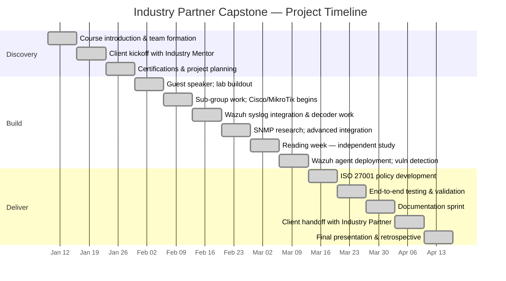

# Industry Partner — Capstone Project

## Client Overview

**Industry Partner.** is a company known throughout Canada for innovation and leadership in business-to-business telecommunications services. The company delivers high-quality communication services and integrates multiple technologies to address remote voice, data, and video challenges inherent to Canada's geography.

**Primary Markets:** various sectors with a focus on regional industries in Canada.

**Client Contact:** Industry Mentor, Industry Partner

---

## Project Scope

This capstone engagement continued work begun by the Fall 2024 capstone group, with two primary objectives:

### 1. ISO 27001:2022 Certification Journey

Building on the Fall 2024 group's preliminary work toward ISO 27001 certification, our team:
- Reviewed existing gap analysis documentation
- Developed an Operations Security Policy aligned with ISO/IEC 27001:2022 Annex A
- Identified areas requiring further attention for certification readiness

### 2. SIEM/Logging Tool Evaluation & Deployment

Industry Partner's existing monitoring infrastructure uses **OpenNMS**. Our mandate was to evaluate and deploy a complementary SIEM solution:
- Evaluated Wazuh as the primary SIEM platform
- Deployed Wazuh 4.9.2 in a Hyper-V virtual lab environment
- Integrated Cisco IOSv and MikroTik network devices for centralized log collection
- Documented deployment procedures and provided scripts for ongoing maintenance

---

## Team Structure

The project team of 7 members was organized into functional sub-groups:

| Group | Focus Area |
|-------|-----------|
| **Group 1** | Wazuh instance configuration, dashboard management, agent deployment |
| **Group 2** | Network device integration (Cisco, MikroTik), syslog forwarding, custom decoders |

### My Role (Group 2 — Network Device Integration)

I was a member of Group 2, focused on integrating network devices with the centralized SIEM. My primary responsibilities included:

- **Syslog integration scripting** — Authored the `wazuh_setup.sh` automation script and supporting tools
- **Cisco decoder troubleshooting** — Led investigation and resolution of XML parsing failures in Wazuh decoder files
- **MikroTik log forwarding** — Configured MikroTik CHR to send syslog data to Wazuh
- **Version stability testing** — Identified and documented Wazuh 4.10.1 critical bugs, recommended version lock to 4.9.2
- **ISO 27001 contributions** — Contributed logging and monitoring sections to the Operations Security Policy

---

## Project Timeline

| Week | Activity |
|------|----------|
| 1 | Course introduction, team formation, client matching |
| 2 | Initial client meeting with Industry Mentor; project scope briefing |
| 3 | Lab environment planning; Wazuh instance access; task allocation |
| 4 | Guest speaker (Industry Speaker); lab buildout continues |
| 5 | Sub-group meetings with client; Cisco/MikroTik agent work begins |
| 6 | Wazuh syslog integration; Cisco decoder troubleshooting; progress reports |
| 7 | SNMP integration research; Graylog evaluation; advanced Wazuh configuration |
| 8 | Reading week — independent study, documentation catch-up |
| 9 | Wazuh agent deployment on Windows Server; vulnerability detection module |
| 10 | ISO 27001 Operations Security Policy development; gap analysis documentation |
| 11 | End-to-end testing and validation; alert threshold tuning |
| 12 | Documentation sprint; knowledge transfer guide preparation |
| 13 | Client handoff session with Industry Mentor; live demonstration |
| 14 | Final capstone presentation; retrospective and course wrap-up |

---

## Key Documents

| Document | Description |
|----------|-------------|
| [Architecture](ARCHITECTURE.md) | Virtual lab environment design and networking |
| [Wazuh Deployment](WAZUH_DEPLOYMENT.md) | SIEM installation, configuration, and validation |
| [ISO 27001 Journey](ISO_27001_JOURNEY.md) | Compliance work and policy development |
| [Operations Security Policy](OPERATIONS_SECURITY_POLICY.md) | ISO 27001-aligned operations security policy |
| [Findings & Recommendations](FINDINGS_AND_RECOMMENDATIONS.md) | Technical findings and future roadmap |
| [Wazuh Setup Script](scripts/wazuh_setup.sh) | Automated deployment and validation script |

---

## Technologies Used

| Category | Technology |
|----------|-----------|
| **SIEM** | Wazuh 4.9.2 |
| **Virtualization** | Hyper-V, GNS3 |
| **Network Devices** | Cisco IOSv, MikroTik CHR |
| **Monitoring** | OpenNMS (existing), Wazuh Dashboard |
| **Operating Systems** | Debian (Wazuh), Windows Server 2022, Windows 11 |
| **Remote Access** | Tailscale VPN |
| **Scripting** | Bash, Python |
| **Compliance** | ISO/IEC 27001:2022 |
