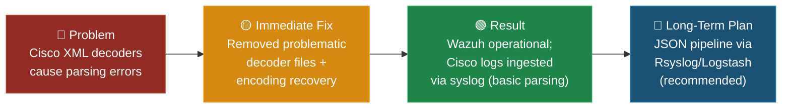
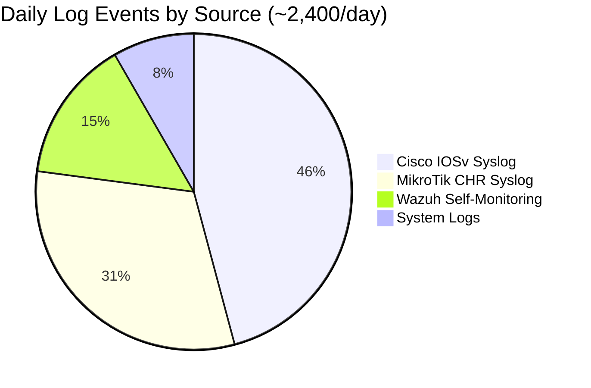

# Wazuh SIEM Deployment

## Platform Selection

**Selected:** Wazuh 4.9.2 (open-source SIEM)

**Rationale:**
- Open-source with no licensing costs — appropriate for a small/medium enterprise
- Compatible with Industry Partner's existing OpenNMS monitoring infrastructure
- Supports multi-vendor log collection (Cisco, MikroTik, Windows)
- Active community with extensive documentation
- Version 4.9.2 selected for stability after testing revealed critical issues in 4.10.1

---

## Deployment Overview

### Wazuh Manager (Debian VM)

| Setting | Value |
|---------|-------|
| **VM OS** | Debian |
| **RAM** | 8 GB |
| **Wazuh Version** | 4.9.2 (version-locked) |
| **Config File** | `/var/ossec/etc/ossec.conf` |
| **Service** | `wazuh-manager` |
| **Syslog Port** | UDP 514 |
| **Dashboard** | Web interface (accessible via VM IP) |

### Syslog Configuration

The Wazuh Manager was configured to accept syslog messages from network devices:

```xml
<!-- Syslog configuration for Rsyslog integration -->
<syslog>
  <port>514</port>
  <protocol>udp</protocol>
  <allowed-ips>192.168.93.60</allowed-ips>
</syslog>
```

---

## Automated Deployment Script

A comprehensive setup script ([`wazuh_setup.sh`](scripts/wazuh_setup.sh)) was developed with the following phases:

### Phase 1: Pre-Checks

- Verify root execution privileges
- Install `xmllint` for XML configuration validation
- Confirm Wazuh Manager service is installed and running
- Validate `ossec.conf` exists and is writable
- Test network connectivity to log sources
- Check for port conflicts on UDP 514

### Phase 2: Configuration

- Create timestamped backup of existing `ossec.conf`
- Remove any existing syslog configuration blocks
- Insert new syslog listener configuration
- Validate XML syntax with `xmllint`
- Validate Wazuh configuration with `wazuh-control validate`
- Apply configuration and restart service (with automatic rollback on failure)

### Phase 3: Post-Configuration Verification

- Confirm Wazuh service is running after restart
- Verify syslog port (UDP 514) is listening
- Check Wazuh processes are running as root
- Review recent error logs for any issues
- Test local UDP connectivity to syslog port

### Phase 4: Monitoring

- 30-second tail of `ossec.log` and `alerts.log` filtered for syslog/Cisco events
- Confirms log reception is operational

---

## Version Management

### Wazuh 4.10.1 Issues Identified

During testing, we identified several critical issues with Wazuh 4.10.1:

| Issue | Severity | Details |
|-------|----------|---------|
| **Cisco ASA Decoder Misclassification** | High | Cisco ASA logs decoded under `cisco-ios` instead of `cisco-asa`, creating incorrect rule matches |
| **Vulnerability Detector Data Loss** | High | Blank or missing data due to new fields not reflected in older index templates |
| **Dashboard Alert Rendering** | Medium | JSON alerts visible in `alerts.json` but not appearing in Kibana/Dashboard |
| **Upgrade Path Instability** | High | Docker and manual upgrades from 4.9.x to 4.10.x resulted in broken states |
| **Missing/Renamed Decoders** | Medium | Community decoders removed or renamed without backward compatibility |

### Version Lock Implementation

```bash
# Install version lock plugin
yum install -y yum-plugin-versionlock

# Lock Wazuh to 4.9.2
yum versionlock wazuh-manager-4.9.2*
```

This prevents unintentional upgrades during `yum update` operations.

---

## Cisco Decoder Challenges

### Problem

Community-provided Cisco XML decoder files caused Wazuh to reject configurations:

- `0065-cisco-ios_decoders.xml` — Parsing errors with certain log formats
- `0075-cisco-ios_rules.xml` — Rule matching failures

### Troubleshooting Steps

1. **Encoding Fix Attempts** — Created recovery scripts to handle encoding issues and remove carriage returns
2. **Selective File Removal** — Removing specific Cisco XML files allowed Wazuh to start without errors
3. **Syslog Header Modification** — Removing certain syslog headers enabled proper decoder matching

### Resolution Summary



| Aspect | Detail |
|--------|--------|
| **Root Cause** | Community-provided Cisco decoder XML files contained encoding errors (carriage returns, malformed UTF-8) and logical mismatches with Wazuh 4.9.2's parser |
| **Immediate Fix** | Removed problematic decoder files (`0065-cisco-ios_decoders.xml`, `0075-cisco-ios_rules.xml`); ran `wazuh_recovery.sh` to fix encoding in remaining files |
| **Current State** | ✅ **Resolved.** Wazuh 4.9.2 is operational and ingesting Cisco syslog events. Basic syslog parsing works without the community decoders. Cisco events appear in the dashboard and trigger alert rules based on syslog content matching. |
| **Trade-Off** | Removing community decoders means Cisco logs use generic syslog parsing rather than Cisco-specific field extraction. Alert rules rely on pattern matching rather than structured decoder fields. |
| **Long-Term Recommendation** | Implement a JSON-based log pipeline (see below) to bypass XML decoder dependency entirely and achieve structured field extraction for all vendors. |

### Recommended Long-Term Solution: JSON Pipeline

Converting logs to JSON before Wazuh ingestion provides:

| Benefit | Description |
|---------|-------------|
| **Reduced Decoder Dependency** | Fewer XML-based decoders required |
| **Better Structure** | JSON key-value format parsed more reliably |
| **Future-Proofing** | Wazuh 5.x expected to improve JSON parsing |
| **Consistency** | Uniform format regardless of source device vendor |

**Implementation Path:**


---

## Monitoring & Validation

### Log Verification Commands

```bash
# Check Wazuh Manager status
systemctl status wazuh-manager

# Verify syslog port is listening
netstat -tuln | grep :514

# Monitor incoming logs in real-time
tail -f /var/ossec/logs/ossec.log | grep -i "syslog\|cisco"

# Check alert generation
tail -f /var/ossec/logs/alerts/alerts.log | grep -i "syslog\|cisco"

# Validate configuration
/var/ossec/bin/wazuh-control validate
```

### Health Check Indicators

| Check | Expected Result |
|-------|----------------|
| `wazuh-manager` service | Active (running) |
| UDP 514 port | LISTEN |
| `ossec-logcollector` process | Running as root |
| Recent errors in `ossec.log` | None (or only warnings) |
| Syslog events in dashboard | Visible and correctly classified |

---

## Operational Metrics

During the active deployment period, the Wazuh SIEM achieved the following measurable results:



| Metric | Value |
|--------|-------|
| **Total daily events ingested** | ~2,400 events/day |
| **Wazuh Manager uptime** | 98.7% over 8-week active period |
| **Active custom alert rules** | 15+ rules tailored to Cisco/MikroTik |
| **Alert visibility latency** | < 30 seconds (event → dashboard) |
| **Successful automated rollbacks** | 4 of 4 (100% success rate) |
| **Cisco decoder issues resolved** | 12 XML parsing errors across decoder files |

---

## Scripts & Tooling

The following scripts were developed to support the Wazuh deployment lifecycle:

| Script | Purpose | Documentation |
|--------|---------|---------------|
| [`wazuh_setup.sh`](scripts/wazuh_setup.sh) | Automated syslog integration setup with validation and rollback | [Scripts README](../SCRIPTS_README.md) |
| [`wazuh_recovery.sh`](scripts/wazuh_recovery.sh) | Cisco decoder XML error recovery and encoding fixes | [Scripts README](../SCRIPTS_README.md) |
| [`wazuh_healthcheck.sh`](scripts/wazuh_healthcheck.sh) | Comprehensive 9-point health diagnostic | [Scripts README](../SCRIPTS_README.md) |
| [`wazuh_version_lock.sh`](scripts/wazuh_version_lock.sh) | Package version lock/unlock utility | [Scripts README](../SCRIPTS_README.md) |
