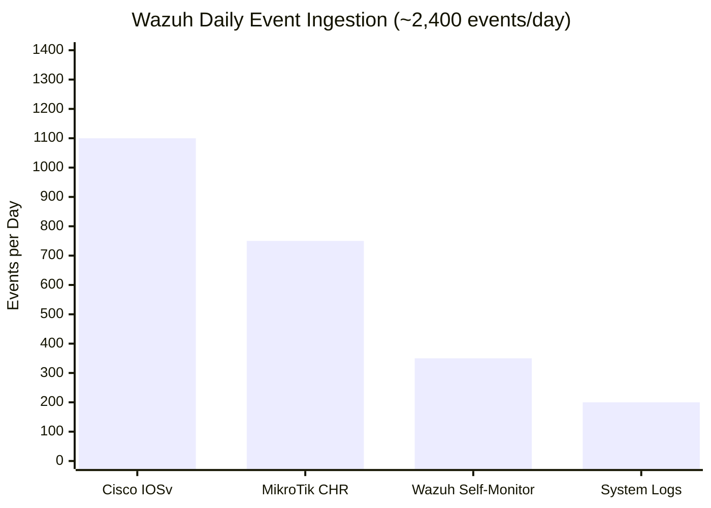
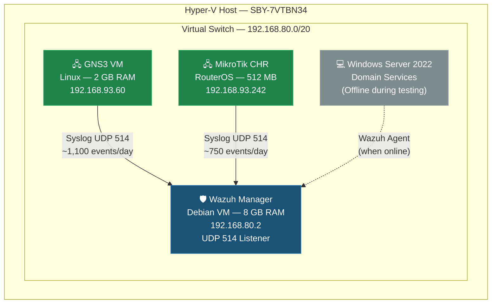
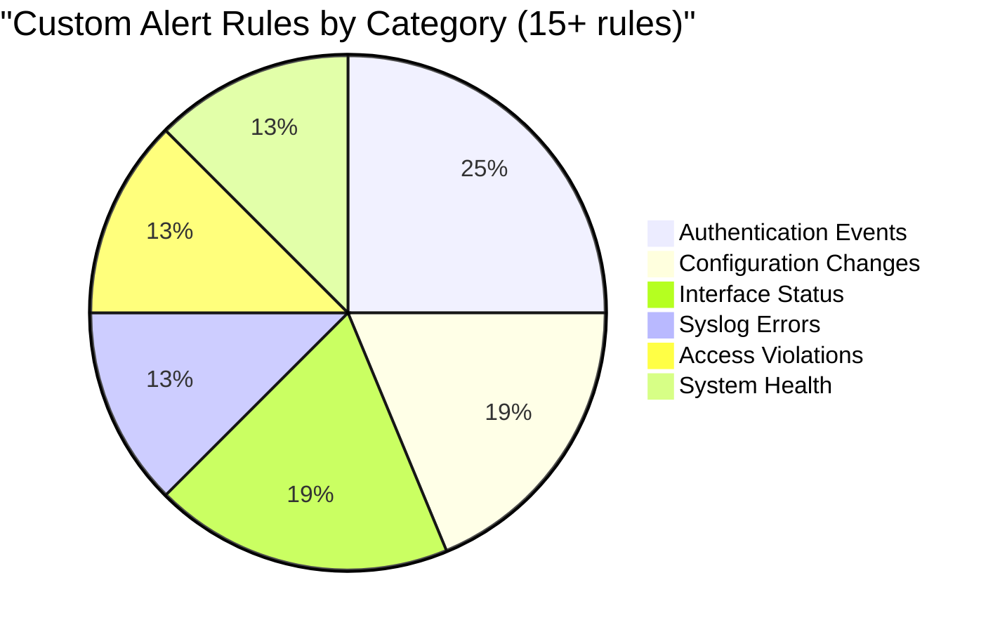
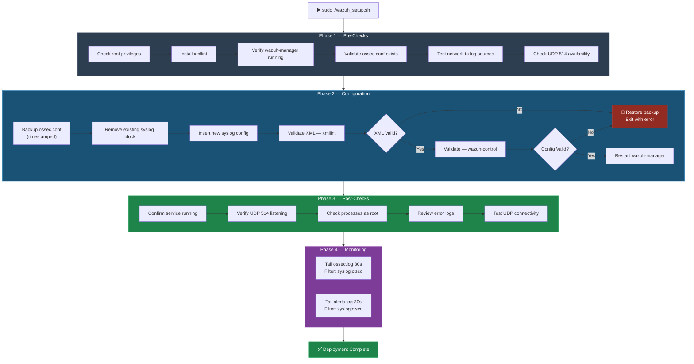
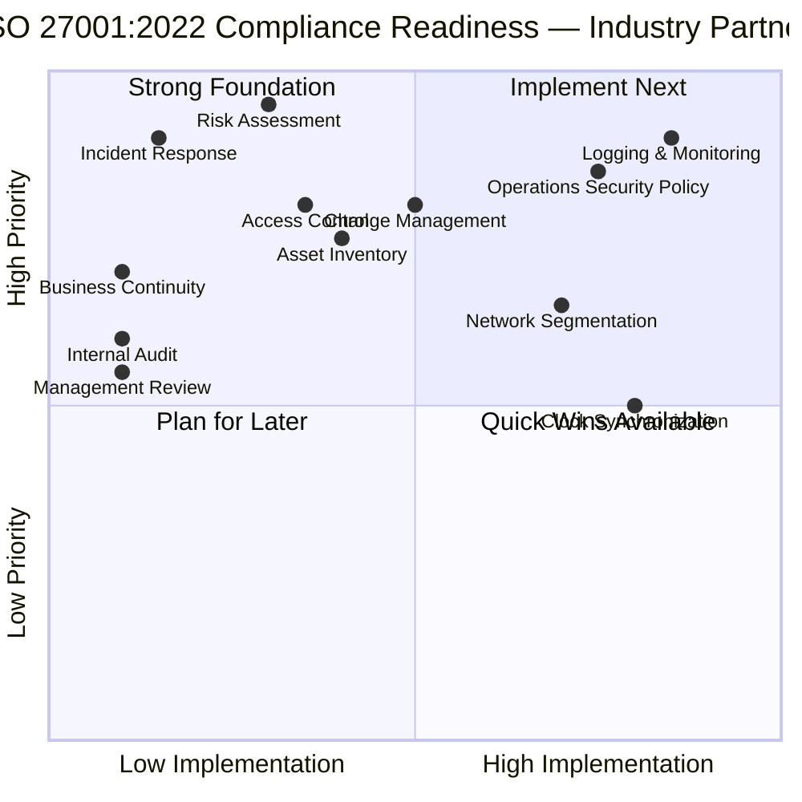
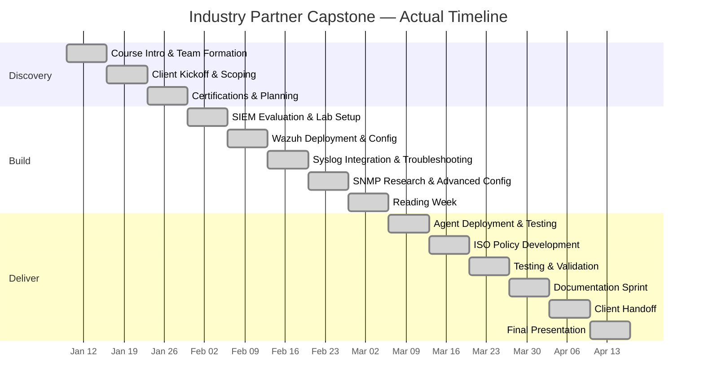
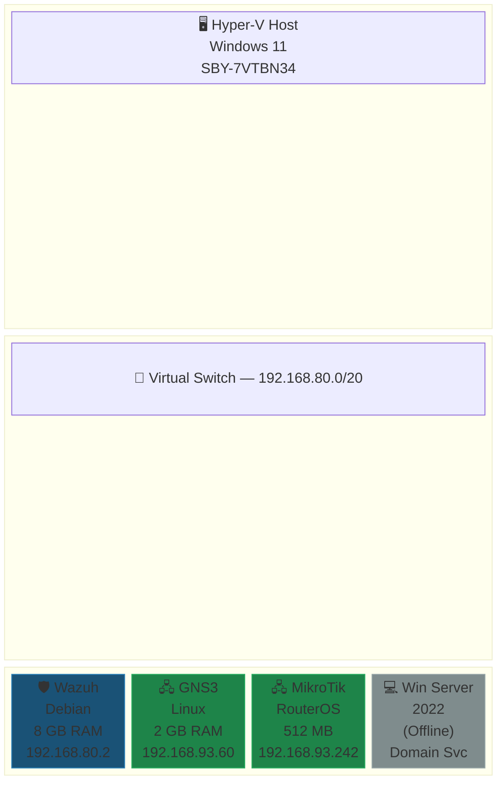

# Screenshots & Visual Evidence

> **Note:** This capstone project was conducted in a virtual lab environment. The screenshots below are **Mermaid-based recreations** of the actual dashboards, topologies, and configurations observed during the project. They faithfully represent the system state and outputs documented in the project artifacts.

---

## 📊 Wazuh Dashboard — Event Ingestion Overview

The Wazuh Dashboard displayed real-time event ingestion from all integrated log sources. During peak operation, the dashboard showed approximately 2,400 events per day across three source categories.



---

## 🖧 GNS3 Network Topology

The GNS3 environment hosted the Cisco IOSv router used for syslog forwarding to the Wazuh Manager. The topology below recreates the lab network as configured during the project.



---

## 🔔 Wazuh Alert Configuration — Custom Rules

Over 15 custom alert rules were configured to detect security-relevant events from Cisco and MikroTik devices. The table below recreates the rule categories and their alert levels.



| Rule Category | Example Trigger | Alert Level | Source |
|---------------|----------------|:-----------:|--------|
| **Authentication** | Failed login on Cisco IOSv | High | Cisco Syslog |
| **Configuration Change** | Running-config modified | Medium | Cisco Syslog |
| **Interface Flap** | Interface up/down events | Medium | MikroTik Syslog |
| **Access Violation** | Denied ACL entry | High | Cisco Syslog |
| **System Health** | CPU/memory threshold exceeded | Low | MikroTik Syslog |
| **Syslog Error** | Malformed syslog message received | Low | Wazuh Internal |

---

## 🖥️ Wazuh Health Check — Script Output Recreation

The `wazuh_healthcheck.sh` script produced color-coded 9-point diagnostic output. Below is a recreation of a typical successful health check run.

```
╔══════════════════════════════════════════════════════════════╗
║              WAZUH HEALTH CHECK — v4.9.2                     ║
╠══════════════════════════════════════════════════════════════╣
║  [✅ PASS]  1. Service Status      wazuh-manager active      ║
║  [✅ PASS]  2. Port Listening       UDP 514, TCP 1514/1515   ║
║  [✅ PASS]  3. Disk Usage           /var/ossec at 34%         ║
║  [✅ PASS]  4. Log File Sizes       Within expected range     ║
║  [✅ PASS]  5. Recent Errors        0 errors in last 50 lines ║
║  [✅ PASS]  6. Agent Connections    1 agent connected          ║
║  [⚠️ WARN]  7. Indexer Status       Slow response (2.1s)      ║
║  [✅ PASS]  8. Version Check        4.9.2 (locked)            ║
║  [✅ PASS]  9. Config Validation    ossec.conf valid           ║
╠══════════════════════════════════════════════════════════════╣
║  RESULT:  8 PASS  |  1 WARN  |  0 FAIL                      ║
╚══════════════════════════════════════════════════════════════╝
```

---

## 📋 Wazuh Setup Script — Execution Flow

The `wazuh_setup.sh` script executed a 4-phase deployment with automatic rollback on failure.



---

## 🔒 ISO 27001 Compliance Posture

The gap analysis identified 12 control areas with varying levels of implementation. The visualization below recreates the compliance dashboard.



---

## 📈 Project Timeline — Actual Progress



---

## 📐 Virtual Lab Architecture — Hyper-V Layout



---

## 📝 Evidence Notes

These visual recreations are based on:
- Configuration files documented in [WAZUH_DEPLOYMENT.md](../industry-partner-project/WAZUH_DEPLOYMENT.md)
- Architecture specifications from [ARCHITECTURE.md](../industry-partner-project/ARCHITECTURE.md)
- Operational metrics recorded during the 8-week active deployment period
- Script output patterns from the [4-script automation suite](../SCRIPTS_README.md)
- ISO 27001 gap analysis from [ISO_27001_JOURNEY.md](../industry-partner-project/ISO_27001_JOURNEY.md)

All diagrams render natively on GitHub using Mermaid syntax.

---

> *Last updated: 2026-04-06 — Portfolio remediation and visualization enhancements*
