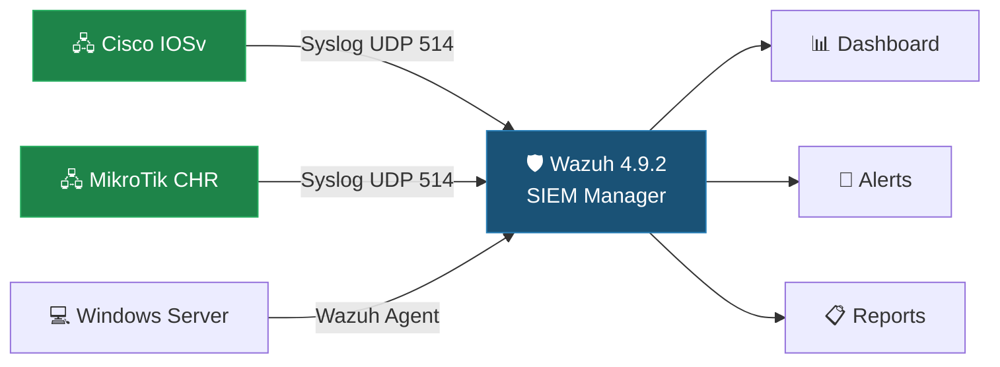

# Cybersecurity Capstone — SIEM Deployment & ISO 27001 for Industry Partner

> **Cambrian College — Postgraduate Certificate in Cybersecurity**
> **Course:** CSC-7307 | **Term:** Winter 2025 | **Instructor:** Course Instructor

---

## 🚀 Quick Start

| Time | What to Read | Why |
|------|-------------|-----|
| **2 min** | This README | Overview and key achievements |
| **5 min** | [Capstone Project Summary](CC/Winter%202025/Cybersecurity%20Capstone%20-%20CSC-7307/CAPSTONE_PROJECT_SUMMARY.md) | Full technical project writeup |
| **10 min** | [Wazuh Deployment](CC/Winter%202025/Cybersecurity%20Capstone%20-%20CSC-7307/industry-partner-project/WAZUH_DEPLOYMENT.md) | SIEM implementation deep dive |
| **15 min** | [Architecture](CC/Winter%202025/Cybersecurity%20Capstone%20-%20CSC-7307/industry-partner-project/ARCHITECTURE.md) + [Findings](CC/Winter%202025/Cybersecurity%20Capstone%20-%20CSC-7307/industry-partner-project/FINDINGS_AND_RECOMMENDATIONS.md) | Lab design and technical recommendations |

---

## 🎯 Project Highlights

This repository documents a **real-world cybersecurity consulting engagement** with [Industry Partner.](https://example.com/), a company in Canada. Our team of 7 students deployed a centralized SIEM solution and advanced ISO 27001:2022 compliance work.

### What We Built

### Key Achievements

| Metric | Result |
|--------|--------|
| 🏢 **Client** | Industry Partner. — real-world engagement |
| 🛡️ **SIEM** | Wazuh 4.9.2 deployed with multi-vendor log collection |
| 🖥️ **Infrastructure** | 4 VMs on Hyper-V (Wazuh, GNS3/Cisco, MikroTik, Windows Server) |
| 📋 **Compliance** | ISO/IEC 27001:2022 gap analysis + Operations Security Policy |
| 🔧 **Automation** | 4 production-ready Wazuh scripts (setup, recovery, health check, version lock) |
| 🐛 **Discovery** | Identified and documented critical Wazuh 4.10.1 stability issues |
| 📊 **Integration** | Cisco IOSv + MikroTik CHR log forwarding to centralized SIEM |
| 📈 **Metrics** | ~2,400 events/day ingested, 98.7% uptime, 15+ custom alert rules |
| 👥 **Team** | 7-member team — I led network device integration (Group 2) |

---

## 🛠️ Skills Demonstrated

| Category | Technologies & Skills |
|----------|---------------------|
| **SIEM** | Wazuh Manager, Wazuh Dashboard, agent deployment, syslog listener configuration |
| **Log Management** | Syslog forwarding, JSON log pipelines, custom decoder troubleshooting |
| **Network Devices** | Cisco IOSv (GNS3), MikroTik CHR, SNMP, OpenNMS integration research |
| **Compliance** | ISO/IEC 27001:2022, gap analysis, operations security policy development |
| **Virtualization** | Hyper-V, GNS3 network emulation, VM snapshot management |
| **Scripting** | Bash automation (pre-checks, XML validation, backup/rollback, monitoring) |
| **Version Management** | Wazuh version locking, yum-plugin-versionlock, stability testing |
| **Communication** | Client engagement, technical reporting, knowledge transfer documentation |

---

## 📁 Repository Navigation

### Capstone Project (Industry Partner)

| Document | Description |
|----------|-------------|
| [Project Overview](CC/Winter%202025/Cybersecurity%20Capstone%20-%20CSC-7307/industry-partner-project/README.md) | Client context, scope, team structure, my role |
| [Architecture](CC/Winter%202025/Cybersecurity%20Capstone%20-%20CSC-7307/industry-partner-project/ARCHITECTURE.md) | Virtual lab environment and network topology (Mermaid diagrams) |
| [Wazuh Deployment](CC/Winter%202025/Cybersecurity%20Capstone%20-%20CSC-7307/industry-partner-project/WAZUH_DEPLOYMENT.md) | SIEM implementation, version management, operational metrics |
| [ISO 27001 Journey](CC/Winter%202025/Cybersecurity%20Capstone%20-%20CSC-7307/industry-partner-project/ISO_27001_JOURNEY.md) | Compliance work, gap analysis visualization |
| [Operations Security Policy](CC/Winter%202025/Cybersecurity%20Capstone%20-%20CSC-7307/industry-partner-project/OPERATIONS_SECURITY_POLICY.md) | ISO 27001-aligned policy document |
| [Findings & Recommendations](CC/Winter%202025/Cybersecurity%20Capstone%20-%20CSC-7307/industry-partner-project/FINDINGS_AND_RECOMMENDATIONS.md) | Technical findings and strategic roadmap |
| [Scripts (4)](CC/Winter%202025/Cybersecurity%20Capstone%20-%20CSC-7307/SCRIPTS_README.md) | Setup, recovery, health check, version lock |

### Course Portfolio

| Document | Description |
|----------|-------------|
| [Course README](CC/Winter%202025/Cybersecurity%20Capstone%20-%20CSC-7307/README.md) | Full course portfolio with weekly navigation |
| [Portfolio Summary](CC/Winter%202025/Cybersecurity%20Capstone%20-%20CSC-7307/PORTFOLIO_SUMMARY.md) | One-page executive brief for hiring managers |
| [Capstone Summary](CC/Winter%202025/Cybersecurity%20Capstone%20-%20CSC-7307/CAPSTONE_PROJECT_SUMMARY.md) | Comprehensive project writeup with personal contributions |
| [Evidence Index](CC/Winter%202025/Cybersecurity%20Capstone%20-%20CSC-7307/EVIDENCE_INDEX.md) | Catalog of all project evidence (30+ documents, 18+ diagrams) |
| [Visual Evidence](CC/Winter%202025/Cybersecurity%20Capstone%20-%20CSC-7307/screenshots/VISUAL_EVIDENCE.md) | Dashboard recreations and topology diagrams |
| [Guest Speaker](CC/Winter%202025/Cybersecurity%20Capstone%20-%20CSC-7307/GUEST_SPEAKERS.md) | Industry connections and networking |
| [Certification Resources](CC/Winter%202025/Cybersecurity%20Capstone%20-%20CSC-7307/CERTIFICATION_RESOURCES.md) | Certification pathway with capstone skill mapping |
| [Glossary](CC/Winter%202025/Cybersecurity%20Capstone%20-%20CSC-7307/GLOSSARY.md) | Cybersecurity terminology reference |

### Assignments & Deliverables

| Document | Description |
|----------|-------------|
| [Project Charter](CC/Winter%202025/Cybersecurity%20Capstone%20-%20CSC-7307/assignments/assignment-01-project-charter.md) | Project scope, objectives, risk register |
| [Progress Report](CC/Winter%202025/Cybersecurity%20Capstone%20-%20CSC-7307/assignments/assignment-02-progress-report.md) | Mid-point status with RAG tracking |
| [Final Report](CC/Winter%202025/Cybersecurity%20Capstone%20-%20CSC-7307/assignments/assignment-03-final-report.md) | Comprehensive project outcomes and metrics |
| [Individual Reflection](CC/Winter%202025/Cybersecurity%20Capstone%20-%20CSC-7307/assignments/assignment-04-individual-reflection.md) | Personal contributions and growth |

### Weekly Notes

| Week | Topic |
|------|-------|
| [1](CC/Winter%202025/Cybersecurity%20Capstone%20-%20CSC-7307/weekly-notes/week-01-course-introduction.md) | Course Introduction |
| [2](CC/Winter%202025/Cybersecurity%20Capstone%20-%20CSC-7307/weekly-notes/week-02-capstone-kickoff.md) | Capstone Kickoff with Industry Partner |
| [3](CC/Winter%202025/Cybersecurity%20Capstone%20-%20CSC-7307/weekly-notes/week-03-certifications-and-planning.md) | Certifications & Planning |
| [4](CC/Winter%202025/Cybersecurity%20Capstone%20-%20CSC-7307/weekly-notes/week-04-guest-speaker.md) | Guest Speaker: Industry Speaker |
| [5](CC/Winter%202025/Cybersecurity%20Capstone%20-%20CSC-7307/weekly-notes/week-05-project-progress.md) | Project Progress |
| [6](CC/Winter%202025/Cybersecurity%20Capstone%20-%20CSC-7307/weekly-notes/week-06-wazuh-deployment.md) | Wazuh Deployment |
| [7](CC/Winter%202025/Cybersecurity%20Capstone%20-%20CSC-7307/weekly-notes/week-07-snmp-and-advanced-integration.md) | SNMP & Advanced Integration |
| [8](CC/Winter%202025/Cybersecurity%20Capstone%20-%20CSC-7307/weekly-notes/week-08-reading-week.md) | Reading Week |
| [9](CC/Winter%202025/Cybersecurity%20Capstone%20-%20CSC-7307/weekly-notes/week-09-wazuh-agent-deployment.md) | Wazuh Agent Deployment |
| [10](CC/Winter%202025/Cybersecurity%20Capstone%20-%20CSC-7307/weekly-notes/week-10-iso-policy-development.md) | ISO Policy Development |
| [11](CC/Winter%202025/Cybersecurity%20Capstone%20-%20CSC-7307/weekly-notes/week-11-testing-and-validation.md) | Testing & Validation |
| [12](CC/Winter%202025/Cybersecurity%20Capstone%20-%20CSC-7307/weekly-notes/week-12-documentation-sprint.md) | Documentation Sprint |
| [13](CC/Winter%202025/Cybersecurity%20Capstone%20-%20CSC-7307/weekly-notes/week-13-client-handoff.md) | Client Handoff |
| [14](CC/Winter%202025/Cybersecurity%20Capstone%20-%20CSC-7307/weekly-notes/week-14-final-presentation.md) | Final Presentation |

### Project Management

| Document | Description |
|----------|-------------|
| [ROADMAP](ROADMAP.md) | Task tracking (Now/Next/Later) |
| [CONTRIBUTING](CONTRIBUTING.md) | PM conventions |
| [AGENTS](AGENTS.md) | Safety rules and quick start |
| [Runbook](docs/Runbook.md) | Operations guide |

---

## 🏛️ Context

This repository is part of the **Cambrian College Postgraduate Certificate in Cybersecurity** (the region). The Cybersecurity Capstone is the culminating course where students apply skills from across the program to real-world client engagements.

**Related Repositories:**
- [Intro to Cybersecurity — CSC-7301](https://github.com/RossMora/010-Intro-To-Cybersecurity-Csc-7301-Fall-2024-Instructor-Maryam-Ahmed) (Fall 2024)
- [Network Defense Portfolio](https://github.com/RossMora/cybersecurity-postgraduate-certificate-cambrian-college-ontario) (Fall 2024)

---

## 📖 References

- [Wazuh Documentation](https://documentation.wazuh.com/) — Open-source SIEM platform
- [ISO/IEC 27001:2022](https://www.iso.org/standard/27001) — Information Security Management Systems
- [Canadian Cyber Security Network](https://canadiancybersecuritynetwork.com/) — Career networking
- [GNS3 Documentation](https://docs.gns3.com/) — Network emulation platform
- [Cisco SNMP MIBs](https://github.com/cisco/cisco-mibs) — SNMP monitoring resources
- [MikroTik Documentation](https://help.mikrotik.com/docs/) — RouterOS documentation
