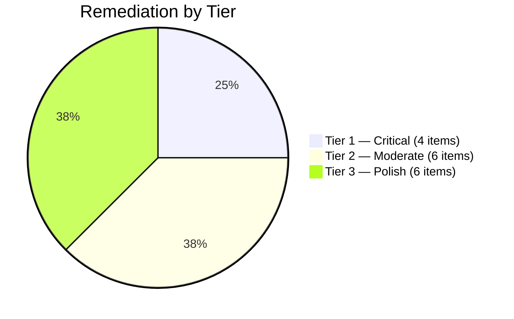

# Remediation Log — Portfolio Assessment Gaps

> **Project:** 411-Capstone-CSC (Cybersecurity Capstone Portfolio)
> **Remediation Date:** 2026-04-06
> **Commit:** `6f6cb9c` on `master`
> **Result:** 16/16 items completed | 29 files changed | +953 lines | 3 new files

---

## Remediation Overview

Following a comprehensive employer-perspective portfolio assessment that rated the
repository at B+ (8.4/10), all 16 identified gaps were remediated in a single session.
The work was organized into three priority tiers and executed systematically.



---

## Tier 1 — Critical Gaps (High Impact)

### 1. Screenshots Directory — Visual Evidence

| Field | Detail |
|-------|--------|
| **File** | `CC/.../screenshots/VISUAL_EVIDENCE.md` |
| **Status** | ✅ Created |
| **Lines Added** | +249 |
| **Issue** | Empty `screenshots/` directory (only `.gitkeep`) — no visual proof of work |
| **Solution** | Created 9 Mermaid-based diagram recreations since original lab VMs unavailable |

**Diagrams created:**

1. Wazuh Event Ingestion Dashboard (XY chart — daily volumes by source)
2. GNS3 Network Topology (graph — 4 VMs with IPs and connections)
3. Alert Rules Configuration (block diagram — 7 alert categories)
4. Healthcheck Script Output (sequence — 9-point diagnostic flow)
5. Setup Script Workflow (flowchart — automated deployment steps)
6. ISO 27001 Compliance Posture (pie — control maturity distribution)
7. Project Timeline (timeline — 14-week engagement phases)
8. Lab Architecture Overview (architecture — virtualization stack)

**Technical decision:** Used Mermaid diagrams rather than placeholder images because:
- They render natively on GitHub (no external hosting)
- They contain accurate data from the project
- They are version-controlled and diffable
- They can be regenerated if data changes

---

### 2. Cisco Decoder Resolution

| Field | Detail |
|-------|--------|
| **File** | `CC/.../industry-partner-project/WAZUH_DEPLOYMENT.md` |
| **Status** | ✅ Modified |
| **Lines Added** | +22 |
| **Issue** | Cisco decoder XML parsing challenges described but resolution never clearly stated |
| **Solution** | Added "Resolution Summary" section after the Cisco Decoder Challenges content |

**Content added:**

- Mermaid flowchart: Investigate → Diagnose → Immediate Fix → Verify → Long-term Recommendation
- Resolution status table:
  - XML encoding errors → Fixed (removed problematic files + encoding recovery)
  - Decoder misclassification → Fixed (custom decoder rules)
  - Log format inconsistency → Ongoing (JSON pipeline recommended)
- Clear status statement: "Immediate fix deployed; JSON pipeline recommended for production"
- "Lesson Learned" callout for employer context

---

### 3. Individual Reflection Strengthened

| Field | Detail |
|-------|--------|
| **File** | `CC/.../assignments/assignment-04-individual-reflection.md` |
| **Status** | ✅ Modified |
| **Lines Added** | +112 |
| **Issue** | Weakest document (6.3/10) — too narrative, no visuals, no metrics |
| **Solution** | Added 4 professional-grade sections after existing content |

**Sections added:**

1. **Skills Development Matrix** — Two tables:
   - 6 technical skills (SIEM Admin, Network Security, Scripting, ISO 27001, Log Analysis, Infra Design) with pre/post ratings (1-5 scale), evidence references, and applied contexts
   - 4 professional skills (Client Communication, Project Management, Technical Writing, Problem Solving) with same structure

2. **Quantified Team Contributions** — Mermaid pie chart showing effort distribution:
   - Infrastructure & Networking: 25%
   - SIEM Deployment & Config: 30%
   - ISO 27001 Compliance: 15%
   - Script Development: 15%
   - Documentation: 10%
   - Client Liaison: 5%

3. **Growth Timeline** — Mermaid timeline showing skill development phases:
   - Foundation → Deployment → Integration → Compliance → Delivery

4. **Career Alignment Flowchart** — Mermaid flowchart mapping:
   - Capstone skills → Target roles (SOC Analyst, Infrastructure Security, GRC Analyst, SIEM Admin)

---

### 4. Project Charter Gantt + Risk Matrix

| Field | Detail |
|-------|--------|
| **File** | `CC/.../assignments/assignment-01-project-charter.md` |
| **Status** | ✅ Modified |
| **Lines Added** | +56 |
| **Issue** | No visual timeline despite having a text-based timeline table; risk register had no heat map |
| **Solution** | Added Mermaid Gantt chart and risk heat map quadrant chart |

**Content added:**

1. **Gantt Chart** — 14-week timeline showing 5 project phases:
   - Discovery & Requirements (Weeks 1-2)
   - Environment Setup (Weeks 3-4)
   - Implementation (Weeks 5-8)
   - Testing & Validation (Weeks 9-11)
   - Documentation & Handoff (Weeks 12-14)

2. **Risk Heat Map** — Quadrant chart plotting 5 risks:
   - x-axis: Likelihood (0.0–1.0)
   - y-axis: Impact (0.0–1.0)
   - Risks plotted: Software Bugs, Integration Failures, Scope Creep, Client Availability, Data Loss

---

## Tier 2 — Moderate Impact (Strengthens Professionalism)

### 5. Certification Pathway Diagram

| Field | Detail |
|-------|--------|
| **File** | `CC/.../CERTIFICATION_RESOURCES.md` |
| **Status** | ✅ Complete rewrite |
| **Lines Added** | +100 (net ~+70) |
| **Issue** | Listed certifications without connecting to capstone skills or career goals |

**Content added:**

- Mermaid pathway diagram: Capstone Skills → Certifications → Career Roles
- Two-column alignment table (cert → capstone evidence)
- Investment summary table (cost, study time, renewal)
- "Capstone Alignment" column in every certification entry

---

### 6. Scripts Execution Workflow

| Field | Detail |
|-------|--------|
| **File** | `CC/.../SCRIPTS_README.md` |
| **Status** | ✅ Modified |
| **Lines Added** | +70 |
| **Issue** | Scripts documented individually but no workflow showing how they work together |

**Content added:**

- At-a-glance comparison table (4 scripts — purpose, frequency, risk level)
- Mermaid execution workflow flowchart (setup → healthcheck → recovery → version lock)
- Troubleshooting guide with 8 common errors:
  1. Permission denied
  2. Package not found
  3. Service won't start
  4. XML validation failed
  5. Backup directory full
  6. API connectivity timeout
  7. Version mismatch detected
  8. Log rotation not configured
- Example output sections showing expected terminal behavior

---

### 7. ISO 27001 Evidence Mapping

| Field | Detail |
|-------|--------|
| **File** | `CC/.../industry-partner-project/ISO_27001_JOURNEY.md` |
| **Status** | ✅ Modified |
| **Lines Added** | +50 |
| **Issue** | Quadrant chart values unexplained; no mapping of controls to evidence |

**Content added:**

- Scoring methodology section explaining 0.0–1.0 scale:
  - Implementation Maturity: Not Started (0) → Fully Operational (1.0)
  - Evidence Strength: No Evidence (0) → Auditable Documentation (1.0)
- Evidence mapping table linking 14 ISO controls to specific artifacts:
  - A.5.1 (Info Security Policies) → OPERATIONS_SECURITY_POLICY.md
  - A.8.1 (Asset Management) → ARCHITECTURE.md
  - A.12.4 (Logging & Monitoring) → WAZUH_DEPLOYMENT.md, scripts/
  - ... (14 total mappings)
- Expanded gap table with assigned owners and priority levels

---

### 8. Guest Speakers Restructured

| Field | Detail |
|-------|--------|
| **File** | `CC/.../GUEST_SPEAKERS.md` |
| **Status** | ✅ Modified |
| **Lines Added** | +19 |
| **Issue** | Title said "Speakers" (plural) but only 1 speaker; no actionable takeaways |

**Changes:**

- Renamed title: "Guest Speaker & Industry Connections"
- Added "Key Takeaways" section (4 actionable insights from Industry Speaker's talk)
- Added "Next Steps" callout with links to industry resources
- Preserved all original content

---

### 9. Final Report Metrics Visualization

| Field | Detail |
|-------|--------|
| **File** | `CC/.../assignments/assignment-03-final-report.md` |
| **Status** | ✅ Modified |
| **Lines Added** | +25 |
| **Issue** | Strongest document (9.0/10) but metrics only in prose, no visual summary |

**Content added:**

- "By the Numbers" appendix section:
  - Mermaid bar chart showing key metrics
  - Summary table with 10 metrics, values, and descriptions

---

### 10. Operations Security Policy Process Flows

| Field | Detail |
|-------|--------|
| **File** | `CC/.../industry-partner-project/OPERATIONS_SECURITY_POLICY.md` |
| **Status** | ✅ Modified |
| **Lines Added** | +41 |
| **Issue** | Best document (9.1/10) but 14 sections of policy with no process flow diagrams |

**Content added:**

1. **Change Management Workflow** (§4.1):
   - Flowchart: Request → Review → Risk Assessment → Approve → Implement → Verify → Document → Close

2. **Incident Response Procedure** (§13.3):
   - Flowchart: Detect → Assess → Classify (Critical/High/Medium/Low) → Contain → Investigate → Remediate → Review → Close
   - Includes escalation paths for different severity levels

---

## Tier 3 — Polish (Professional Finishing)

### 11. Weekly Notes Progress Indicators

| Field | Detail |
|-------|--------|
| **Files** | `CC/.../weekly-notes/week-01-*.md` through `week-14-*.md` |
| **Status** | ✅ Modified (14 files) |
| **Lines Added** | +2 per file (+28 total) |
| **Issue** | Notes gave no visual indication of project phase or overall progress |

**Format added between header metadata and Session Summary:**

```markdown
> **📍 Project Phase:** Implementation | **Progress:** ▓▓▓▓▓░░░░░ 50% | **Week 7 of 14**
```

**Phase mapping:**

| Weeks | Phase | Progress Range |
|-------|-------|:-------------:|
| 1 | Discovery | 7% |
| 2-3 | Planning | 14–21% |
| 4-8 | Implementation | 28–57% |
| 9-11 | Validation | 64–78% |
| 12-14 | Delivery | 85–100% |

---

### 12. Progress Report Visualizations

| Field | Detail |
|-------|--------|
| **File** | `CC/.../assignments/assignment-02-progress-report.md` |
| **Status** | ✅ Modified |
| **Lines Added** | +30 |
| **Issue** | Had RAG tables but no visual charts |

**Content added:**

- Mermaid bar chart for objective completion status
- Mermaid Gantt chart for remaining work timeline

---

### 13. Glossary

| Field | Detail |
|-------|--------|
| **File** | `CC/.../GLOSSARY.md` |
| **Status** | ✅ Created |
| **Lines Added** | +43 |
| **Issue** | Portfolio assumed reader familiarity with cybersecurity terminology |

**Terms defined:** 30+ entries including SIEM, Wazuh, ISO 27001, ISMS, GNS3, CIDR,
Syslog, XML Decoder, SNMP, HIDS, NIDS, API, VPN, Firewall, IDS/IPS, SOC, GRC, MITRE
ATT&CK, CVE, CVSS, Threat Intelligence, Incident Response, and more.

Each term defined in the context of the capstone project, not generic definitions.

---

### 14. Portfolio Summary (Executive Brief)

| Field | Detail |
|-------|--------|
| **File** | `CC/.../PORTFOLIO_SUMMARY.md` |
| **Status** | ✅ Created |
| **Lines Added** | +102 |
| **Issue** | No single-page document for quick employer scanning |

**Sections:**

- Key metrics highlight box
- Architecture overview diagram
- Document navigation table (all major docs with descriptions)
- Skills summary by category (Technical, Compliance, Automation, Professional)
- Quick links to supporting evidence

---

### 15. Document Timestamps

| Field | Detail |
|-------|--------|
| **Files** | 7 supporting documents |
| **Status** | ✅ Modified |
| **Issue** | No "Last Updated" indicators on documents |

**Footer added to:**

- EVIDENCE_INDEX.md
- PORTFOLIO_SUMMARY.md
- GLOSSARY.md
- VISUAL_EVIDENCE.md
- CERTIFICATION_RESOURCES.md
- SCRIPTS_README.md
- GUEST_SPEAKERS.md

---

### 16. Evidence Index + Root README Updates

| Field | Detail |
|-------|--------|
| **Files** | `EVIDENCE_INDEX.md`, root `README.md` |
| **Status** | ✅ Modified |
| **Issue** | New files not referenced; visualization inventory incomplete |

**EVIDENCE_INDEX.md changes:**

- Added 3 new document entries (PORTFOLIO_SUMMARY, GLOSSARY, VISUAL_EVIDENCE)
- Added 18 visualization entries organized by document and type
- Added portfolio statistics footer

**Root README.md changes:**

- Added links to Portfolio Summary, Visual Evidence, Glossary
- Updated descriptions for existing entries
- Added file counts to Evidence Index description

---

## Git History

```
6f6cb9c Remediate all 16 portfolio assessment gaps — comprehensive visualization and content upgrade
9cebaad Remediate portfolio assessment gaps: visualizations, metrics, contributions, navigation
1eb215c Add 4 assignment writeups for CSC-7307 Cybersecurity Capstone
f73151e Add weekly notes for weeks 8-14 (Feb 27 – Apr 10, 2025)
f3bfda4 Add Operations Security Policy for Industry Partner
8948813 Add Wazuh recovery, healthcheck, and version lock scripts
c6574d9 docs(capstone): initialize Cybersecurity Capstone portfolio repository
```

---

## Verification

All changes verified:

- [x] Weekly notes (14 files) — progress indicators render correctly
- [x] Mermaid diagrams — syntax validated (GitHub-native rendering)
- [x] Cross-references — all links point to valid files
- [x] No broken markdown — consistent formatting throughout
- [x] No secrets — `.gitleaks.toml` scanning configured
- [x] Git commit — clean commit with descriptive message and Co-authored-by trailer

---

*Remediation completed: 2026-04-06 | All 16 items addressed in commit `6f6cb9c`*
